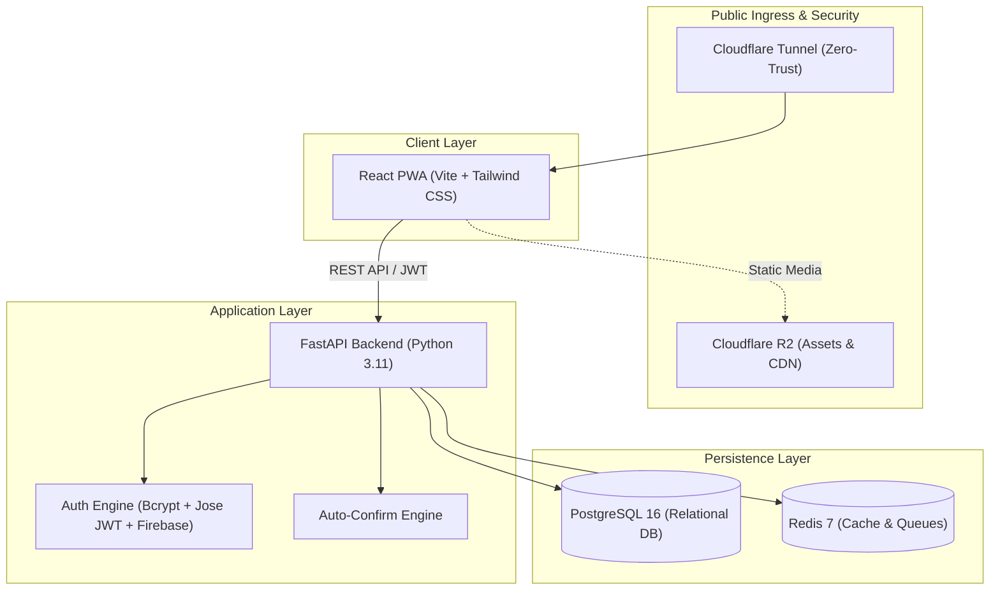

# ShiftBoard 📅⚡

> **Modern Hospitality Call-Board & Shift Scheduling Platform**  
> Connecting service-industry professionals with event venues, restaurants, and bars in real-time.

[](https://fastapi.tiangolo.com)
[](https://www.python.org/)
[-61DAFB.svg?style=flat&logo=react)](https://react.dev/)
[](https://tailwindcss.com/)
[](https://www.postgresql.org/)
[](https://www.docker.com/)

---

## A. Project Overview

**ShiftBoard** is a specialized service-industry scheduling and dispatch platform designed to modernize how hospitality venues (cocktail lounges, banquet halls, restaurants, caterers) staff flexible shifts. Functioning as a high-velocity **community call board**, ShiftBoard enables venue operators to publish shifts with custom role requirements, while qualified workers (bartenders, servers, barbacks, AV techs) can discover, claim, and work shifts with transparent pay rates.

### Core Value Proposition
* **Instant Auto-Confirm Engine**: Workers with high ratings or active venue whitelist status can bypass manual review queues and get instantly booked for shifts.
* **Geofenced Presence Verification**: Integrated GPS verification ensures shift check-ins and check-outs only occur within physical venue perimeters.
* **Frictionless Onboarding**: Dual-authentication model supports fast email/password access and Google/Firebase OAuth.

### Mobile Evolution & Roadmap
ShiftBoard is currently deployed as a responsive, mobile-first **Progressive Web App (PWA)** built with Vite and Nginx, featuring offline caching and homescreen installation. As the platform matures, ShiftBoard is architected to transition toward **native mobile applications** published to the Apple App Store and Google Play Store using React Native / Capacitor wrappers with native push notifications, biometrics, and background geolocation services.

---

## B. Tech Stack & Architecture

ShiftBoard utilizes a decoupled, containerized client-server architecture built for low latency, high throughput, and simple on-premise or cloud deployment.



### Component Details

* **Frontend**:
  * **React 18 & Vite**: Fast single-page application with modular role-based views.
  * **Tailwind CSS**: Dark-themed, mobile-first hospitality UI with responsive navigation.
  * **PWA & Service Worker**: Nginx-served progressive web application with client-side caching.
  * **Client Security**: Axios interceptor attaching JWT bearer tokens, `jwt-decode` session parser, and role-guarded route barriers.
* **Backend**:
  * **Python 3.11 & FastAPI**: Asynchronous REST API utilizing native async/await for all routes.
  * **SQLAlchemy 2.0 & asyncpg**: Fully asynchronous ORM database layer connected to PostgreSQL.
  * **Pydantic v2**: Strict request/response validation, data serialization, and credential filtering.
* **Authentication**:
  * **Dual Authentication System**:
    1. **Local Email / Password**: Passwords hashed securely using `passlib[bcrypt]`, verified on login, and signed into standard HS256 JWTs using `python-jose[cryptography]`.
    2. **Mock / Real Firebase OAuth**: Configurable via `USE_MOCK_FIREBASE=true` for local zero-dependency development, or connected to live Google Identity Toolkit service credentials in production.
* **Infrastructure**:
  * **Docker Compose**: Orchestration for bare-metal hosts and cloud VMs running database, cache, backend, and frontend containers.
  * **PostgreSQL 16**: ACID-compliant transactional persistence with UUID primary keys and geofencing coordinates.
  * **Redis 7**: Caching layer and background queue coordinator with password protection.
  * **Cloudflare Tunnels (`cloudflared`)**: Zero-trust inbound ingress routing external traffic to the stack without opening firewall ports.
  * **Cloudflare R2**: S3-compatible cloud storage for avatars, venue logos, and event attachments.

---

## C. Role & Permission Matrix

ShiftBoard implements strict Role-Based Access Control (RBAC). The platform defines three distinct user personas:

1. **Platform Admin (`platform_admin`)**: System-wide administrative oversight, venue provisioning, tenant lifecycle management, and global platform metrics.
2. **Venue Manager (`venue_manager`)**: Business operators managing one or more venues, publishing shifts with dynamic role breakdowns, reviewing applicant queues, approving/denying workers, and managing trusted worker whitelists.
3. **Worker (`worker`)**: Service industry talent discovering open shifts, submitting shift claims, tracking scheduled shifts, conducting GPS-verified check-in/out, and initiating shift swaps.

### Capabilities Matrix

| Capability | Worker | Venue Manager | Platform Admin |
| :--- | :---: | :---: | :---: |
| **Browse & Filter Open Shifts** | ✅ | ✅ | ✅ |
| **Request / Apply for Open Shift** | ✅ | ❌ | ❌ |
| **Instant Auto-Confirm Engine Execution** | ✅ | ❌ | ❌ |
| **GPS Geofenced Check-In & Check-Out** | ✅ | ❌ | ❌ |
| **Propose / Accept Shift Swaps** | ✅ | ❌ | ❌ |
| **View Personal Work Schedule** | ✅ | ❌ | ❌ |
| **Create & Publish Venue Shifts** | ❌ | ✅ | ✅ |
| **Configure Dynamic Role Requirements** | ❌ | ✅ | ✅ |
| **Manage Shift Approval Queue (Approve/Deny)**| ❌ | ✅ | ✅ |
| **Add / Remove Workers from Venue Whitelist** | ❌ | ✅ | ✅ |
| **Configure Venue Auto-Approve Thresholds** | ❌ | ✅ | ✅ |
| **Create / Provision New Venues** | ❌ | ❌ | ✅ |
| **Assign / Reassign Venue Managers** | ❌ | ❌ | ✅ |
| **Access System-Wide Analytics & Metrics** | ❌ | ❌ | ✅ |
| **Delete Venues & Override Global Settings** | ❌ | ❌ | ✅ |

---

## D. Local Development Setup

Follow these step-by-step instructions to get the complete ShiftBoard stack running on your local machine.

### Prerequisites
* [Docker Desktop](https://www.docker.com/products/docker-desktop/) (v24.0+) with Docker Compose v2.
* Git.

### Step 1: Clone the Repository
```bash
git clone https://github.com/your-org/shift-scheduler.git
cd shift-scheduler
```

### Step 2: Environment & Secrets Configuration
ShiftBoard uses environment files to configure database credentials, authentication keys, and service settings.

1. **Root Application Configuration**:
   ```bash
   # Copy root environment template
   cp .env.template .env
   ```

2. **Docker Secrets Configuration**:
   ```bash
   # Copy secrets template into .secrets directory
   cp .secrets/.secrets.env.template .secrets/.secrets.env
   ```

3. **Backend & Frontend Environments (Optional Overrides)**:
   ```bash
   # Backend local env
   cp backend/.env.template backend/.env

   # Frontend local env
   cp frontend/.env.template frontend/.env
   ```

> [!NOTE]
> The default templates are pre-configured with safe local development values and `USE_MOCK_FIREBASE=true` enabled, allowing immediate startup without external cloud dependencies.

### Step 3: Start the Stack with Docker Compose
Run the following command in the repository root to build and launch all services:

```bash
docker compose up --build
```

To run in detached background mode:
```bash
docker compose up -d --build
```

### Step 4: Verify Service Health
Ensure all containers are healthy and running:
```bash
docker compose ps
```

| Service | Local URL | Description |
| :--- | :--- | :--- |
| **Frontend PWA** | `http://localhost:5173` | React application (with hot-reload) |
| **Backend API** | `http://localhost:8000` | FastAPI application server |
| **Interactive API Docs** | `http://localhost:8000/docs` | Swagger UI documentation |
| **Alternative API Docs** | `http://localhost:8000/redoc` | ReDoc API specifications |
| **PostgreSQL Database** | `localhost:5432` | Relational database instance |
| **Redis Cache** | `localhost:6379` | Cache and message broker |

---

## E. Pre-Seeded Default Accounts

The database seeds automatically on initial startup with realistic mock venues, shifts, and three role-specific demo user accounts:

| Role | Email Address | Password | Default Dashboard |
| :--- | :--- | :--- | :--- |
| **Platform Admin** | `demo_admin@shiftboard.com` | `SuperSecretDemo123!` | `/admin` |
| **Venue Manager** | `demo_manager@shiftboard.com` | `DemoManager123!` | `/venue` |
| **Worker** | `demo_worker@shiftboard.com` | `DemoWorker123!` | `/worker` |

> [!TIP]
> On the login screen (`/login`), click any of the **Quick Demo Credentials** buttons (Admin, Manager, Worker) to instantly pre-fill credentials and sign in.

---

## F. Useful Commands

### Viewing Logs
```bash
# Stream all logs
docker compose logs -f

# Stream backend API logs only
docker compose logs -f backend

# Stream frontend build logs
docker compose logs -f frontend
```

### Rebuilding after Dependency Changes
```bash
# If adding backend or frontend packages
docker compose build --no-cache
docker compose up -d
```

### Resetting the Database
```bash
# Teardown containers and wipe persistent volumes
docker compose down -v

# Relaunch and trigger fresh seed data execution
docker compose up --build
```

---

## License
Proprietary — Internal service-industry platform. All rights reserved.
