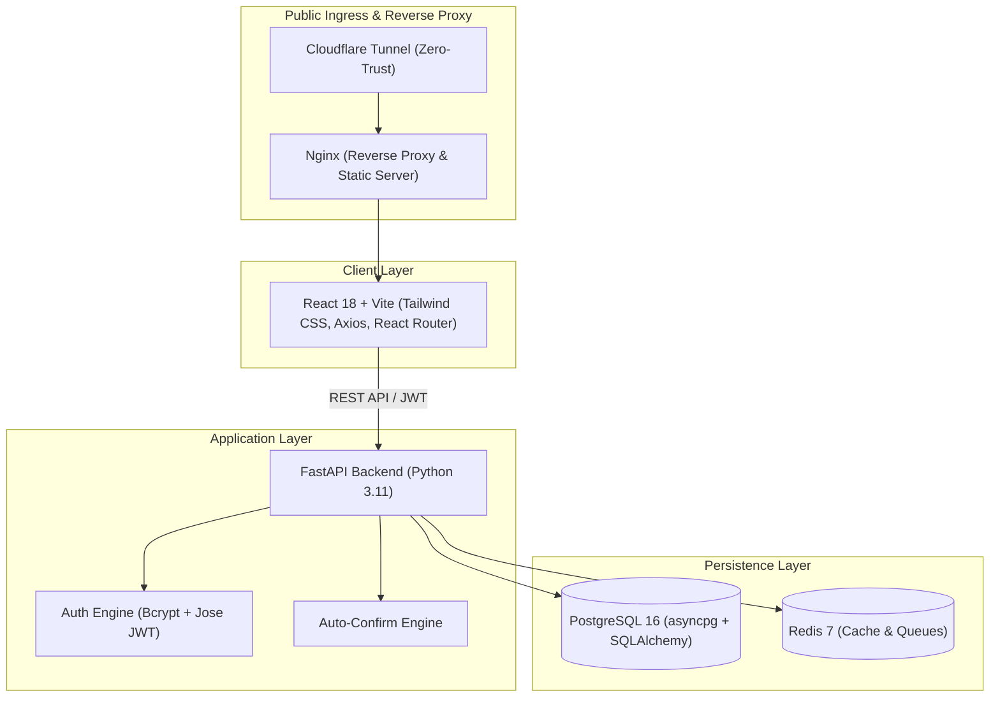

# ShiftBoard 📅⚡

> **Modern Hospitality Call-Board & Shift Scheduling Platform**  
> Connecting service-industry professionals with event venues, restaurants, and bars in real-time.

[](https://fastapi.tiangolo.com)
[](https://www.python.org/)
[-61DAFB.svg?style=flat&logo=react)](https://react.dev/)
[](https://tailwindcss.com/)
[](https://www.postgresql.org/)
[](https://www.docker.com/)

---

## 1. Project Status & Working Features

### Operational Features

* **Authentication System**:
  * Dual-mode authentication supporting local email/password login and configurable Firebase OAuth.
  * Robust password security using `passlib[bcrypt]` salted hashes with defense-in-depth verification.
  * Standard HS256 JWT tokens generated using `python-jose` encoding claims for subject UUID (`sub`), role (`role`), and venue assignments (`venue_id`).
  * Global Axios HTTP interceptors that inject Bearer tokens, automatically handle 401 unauthorized errors, and normalize cross-origin proxy paths.

* **Database Integrity**:
  * High-performance asynchronous PostgreSQL integration powered by SQLAlchemy 2.0 and `asyncpg`.
  * URL-safe dynamic connection strings that properly parse special characters and prevent password authentication failures across containerized environments.
  * Resilient schema design: uses standard `VARCHAR(50)` columns for role attributes to bypass restrictive async driver ENUM casting errors while enforcing strict application-level validation via Pydantic models.

* **Role-Based Access Control (RBAC)**:
  * Client-side session parsing with `jwt-decode` extracts user claims directly on token acquisition.
  * Declarative `<ProtectedRoute allowedRoles={[...]}>` route wrappers prevent unauthorized access across application areas.
  * Isolated, dedicated user dashboards for **Platform Admin** (`/admin`), **Venue Manager** (`/venue`), and **Worker** (`/worker`).

* **Automated Seeding**:
  * Lifecycle startup hook (`seed_initial_data`) verifies and provisions the database on initial launch.
  * Injects pre-configured, bcrypt-hashed demo accounts (Admin, Venue Manager, Worker), realistic venue locations with geofence radii, active shifts, and whitelist records for instant end-to-end testing.

---

## 2. Technical Stack & Architecture

ShiftBoard utilizes a decoupled, containerized client-server architecture built for low latency, high throughput, and developer ergonomics.



### Component Details

* **Frontend**:
  * **React 18 (Vite)**: High-speed single-page application with hot module replacement (HMR).
  * **Tailwind CSS**: Modern dark-themed, mobile-first hospitality interface with responsive typography.
  * **React Router DOM**: Client-side declarative routing and protected route boundaries.
  * **Axios & jwt-decode**: Authenticated HTTP client with token injection and dynamic payload decoding.

* **Backend**:
  * **Python 3.11 & FastAPI**: Asynchronous REST framework utilizing native `async`/`await` endpoints.
  * **SQLAlchemy 2.0**: Asynchronous ORM utilizing `asyncpg` connection pooling and declarative models.
  * **passlib[bcrypt] & python-jose**: Industry-standard cryptographic hashing and JWT lifecycle management.
  * **Pydantic v2**: Type enforcement, input sanitization, and output schema filtering (excluding sensitive credentials).

* **Infrastructure**:
  * **Docker Compose (Bare-Metal Host Network)**: Synchronized container orchestration for development and production environments.
  * **Nginx**: Production web server and API reverse proxy forwarding `/api/` endpoints to the backend.
  * **PostgreSQL 16**: Relational database with UUID primary keys and transactional integrity.
  * **Redis 7**: In-memory key-value cache and background task queue.
  * **Cloudflare Tunnel (`cloudflared`)**: Zero-trust inbound ingress routing external traffic to the stack without opening inbound ports.

---

## 3. Role & Permission Matrix

ShiftBoard implements strict multi-tenant Role-Based Access Control (RBAC):

1. **Platform Admin (`platform_admin`)**: System-wide administrative oversight, venue creation, tenant management, and platform analytics.
2. **Venue Manager (`venue_manager`)**: Operations lead managing venues, publishing shifts, reviewing applicant queues, approving/denying workers, and managing trusted whitelists.
3. **Worker (`worker`)**: Hospitality talent discovering open shifts, submitting shift claims, tracking scheduled shifts, conducting GPS check-ins, and trading shifts.

| Capability | Worker | Venue Manager | Platform Admin |
| :--- | :---: | :---: | :---: |
| **Browse & Filter Open Shifts** | ✅ | ✅ | ✅ |
| **Request / Apply for Open Shift** | ✅ | ❌ | ❌ |
| **Instant Auto-Confirm Engine Execution** | ✅ | ❌ | ❌ |
| **GPS Geofenced Check-In & Check-Out** | ✅ | ❌ | ❌ |
| **Propose / Accept Shift Swaps** | ✅ | ❌ | ❌ |
| **View Personal Work Schedule** | ✅ | ❌ | ❌ |
| **Create & Publish Venue Shifts** | ❌ | ✅ | ✅ |
| **Configure Dynamic Role Requirements** | ❌ | ✅ | ✅ |
| **Manage Shift Approval Queue (Approve/Deny)** | ❌ | ✅ | ✅ |
| **Add / Remove Workers from Venue Whitelist** | ❌ | ✅ | ✅ |
| **Configure Venue Auto-Approve Thresholds** | ❌ | ✅ | ✅ |
| **Create / Provision New Venues** | ❌ | ❌ | ✅ |
| **Assign / Reassign Venue Managers** | ❌ | ❌ | ✅ |
| **Access System-Wide Analytics & Metrics** | ❌ | ❌ | ✅ |
| **Delete Venues & Override Global Settings** | ❌ | ❌ | ✅ |

---

## 4. Developer Setup & Quick-Start Guide

Follow this frictionless guide to launch the complete ShiftBoard stack locally.

### Prerequisites
* [Docker Desktop](https://www.docker.com/products/docker-desktop/) (v24.0+) with Docker Compose v2.
* Git.

### Step 1: Clone the Repository
```bash
git clone https://github.com/your-org/shift-scheduler.git
cd shift-scheduler
```

### Step 2: Configure Environment & Secrets
ShiftBoard utilizes synchronized environment files across Docker services. Initialize your local configuration files:

```bash
# 1. Copy the root environment file
cp .env.template .env

# 2. Copy the secrets configuration into .secrets
cp .secrets/.secrets.env.template .secrets/.secrets.env

# 3. (Optional) Copy backend and frontend environment templates
cp backend/.env.template backend/.env
cp frontend/.env.template frontend/.env
```

> [!NOTE]
> The default templates are pre-configured with safe local development values and `USE_MOCK_FIREBASE=true` enabled, allowing immediate zero-dependency startup.

### Step 3: Clean Build & Launch Stack
To guarantee a fresh database schema and execute initial data seeding cleanly, run the destructive rebuild commands:

```bash
# Tear down existing containers and delete persistent volumes
docker compose down -v

# Rebuild images and start all services in detached background mode
docker compose up -d --build
```

### Step 4: Verify Service Health
Check the container status and health checks:
```bash
docker compose ps
```

| Service | Address | Description |
| :--- | :--- | :--- |
| **Frontend Application** | [http://localhost:5173](http://localhost:5173) | Vite dev server / React SPA |
| **Backend REST API** | [http://localhost:8000](http://localhost:8000) | FastAPI application server |
| **Interactive API Docs** | [http://localhost:8000/docs](http://localhost:8000/docs) | Swagger UI interactive documentation |
| **Alternative API Docs** | [http://localhost:8000/redoc](http://localhost:8000/redoc) | ReDoc API specifications |
| **PostgreSQL Database** | `localhost:5432` | Relational database (shiftboard) |
| **Redis Cache** | `localhost:6379` | In-memory cache & background broker |

---

## 5. Demo Accounts

The backend automatically provisions the database on initial launch with pre-hashed accounts, realistic venues, and test shifts. Use these credentials to test the UI immediately:

| Persona | Email Address | Password | Role Key | Target Dashboard |
| :--- | :--- | :--- | :--- | :--- |
| **Super Admin** | `demo_admin@shiftboard.com` | `SuperSecretDemo123!` | `platform_admin` | `/admin` |
| **Venue Manager** | `demo_manager@shiftboard.com` | `DemoManager123!` | `venue_manager` | `/venue` |
| **Worker** | `demo_worker@shiftboard.com` | `DemoWorker123!` | `worker` | `/worker` |

> [!TIP]
> On the login screen (`/login`), you can also click any of the **Quick Demo Credentials** buttons (Admin, Manager, Worker) to instantly populate the form fields.

---

## 6. Useful Commands & Workflows

### Streaming Logs
```bash
# View all service logs
docker compose logs -f

# View backend logs only
docker compose logs -f backend

# View frontend logs only
docker compose logs -f frontend

# View database logs only
docker compose logs -f database
```

### Rebuilding Containers
```bash
# Rebuild without cache after changing package dependencies
docker compose build --no-cache
docker compose up -d
```

### Resetting Database Schema & Re-Seeding
```bash
# Wipe database volume and re-run seed script
docker compose down -v
docker compose up -d --build
```

---

## License
Proprietary — Internal service-industry call board platform. All rights reserved.
