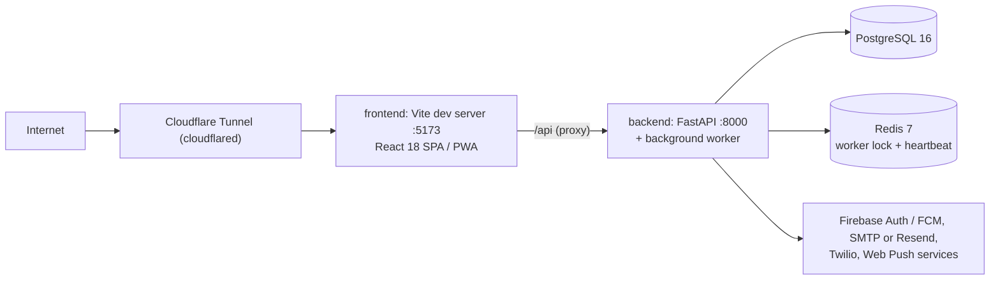

# ShiftBoard

> A shift scheduling and call-board platform for the service industry: venues post events, workers pick up shifts, and everyone knows who is working, where, and when.

**Version:** see `frontend/package.json` (web app) and `backend/src/version.py` (server). History is in [CHANGELOG.md](CHANGELOG.md).

[](https://fastapi.tiangolo.com)
[](https://www.python.org/)
[-61DAFB.svg?style=flat&logo=react)](https://react.dev/)
[](https://www.postgresql.org/)
[](https://www.docker.com/)

---

## Contents
1. [Words we use](#1-words-we-use)
2. [Roles](#2-roles)
3. [What it does](#3-what-it-does)
4. [Architecture](#4-architecture)
5. [Database rules](#5-database-rules)
6. [Running it](#6-running-it)
7. [Configuration](#7-configuration)
8. [Working on the code](#8-working-on-the-code)
9. [Versioning & releases](#9-versioning--releases)

---

## 1. Words we use
These are the words in the app. Use them in code comments, docs and every new screen.

| Word | Meaning | Example | In the code |
| :--- | :--- | :--- | :--- |
| **Event** | The parent: one thing happening at one time and place. | *Saturday Banquet, 5 PM to 1 AM* | `ShiftEvent` / `shift_events` |
| **Shift** | One role and time block inside an event, with a number of spots. | *Bartender, 5 PM to 1 AM, 3 spots* | `Shift` / `shifts` (the `role_type` column holds the position name) |
| **Position** | A job type in the venue's catalog, with default pay. | *Bartender at $28/hr* | `VenuePosition` / `venue_positions` |
| **Booking / request** | One person on one shift, waiting or booked. | *Ava is booked as Bartender* | `ShiftRequest` / `shift_requests` |
| **Hand-off** | A booked worker gives their shift to a named teammate. | | `ShiftTransfer` / `shift_transfers` |
| **Cover request** | A booked worker asks their team (or the public board) to take their shift. | | `CoverRequest` / `cover_requests` |
| **Waitlist** | A line for a full shift. | | `WaitlistEntry` / `waitlist_entries` |
| **Offer** | A manager offers a shift to one or more people; the first to accept gets it. | | `ShiftOffer` / `shift_offers` |

Many API fields still say `positions` for an event's shifts (for example `EventListing.positions[]`). That's a historical name: the UI says **shifts**.

---

## 2. Roles
Every account has exactly one role, stored as plain text in `users.role`.

| Role | Key | Home page | What they do |
| :--- | :--- | :--- | :--- |
| **Platform Admin** | `platform_admin` | `/admin` | Everything, across every venue. The admin console has Overview, Venues, Users, Activity and System tabs. Admins can switch into any venue's manager view, and see the worker view. |
| **Venue Manager** | `venue_manager` | `/venue` | Runs one or more venues: posts events, approves requests and hand-offs, staffs shifts, manages the team, edits time sheets, and downloads hours. |
| **Worker** | `worker` | `/worker` | Finds and requests shifts, clocks in and out, hands off, asks for cover, joins waitlists, and tracks hours and pay. |

Access is enforced on the server by dependencies in `backend/src/auth.py` (`get_current_user`, `require_role(...)` and its shortcuts `require_admin`, `require_manager_or_admin`, `require_worker`, plus `verify_venue_access`. Admins pass every role check). In the browser, `<ProtectedRoute allowedRoles={[...]}>` does the same. Emails listed in `ALWAYS_ADMIN_EMAILS` are always promoted to admin, so you can't get locked out.

---

## 3. What it does

### Signing in
* **Email and password**: bcrypt hashes (`passlib`), HS256 JWTs (`python-jose`). The frontend keeps the token and an Axios interceptor adds it to every call.
* **Google / Firebase sign-in with just-in-time accounts**: the backend verifies the Firebase ID token with `firebase-admin` (`POST /api/auth/firebase-login`), then matches the account in this order:
  1. by Firebase UID;
  2. by verified email, linking the UID to that existing account (which keeps its role);
  3. otherwise it creates a **worker** account on the spot. This needs a verified email and `ALLOW_SELF_REGISTRATION=true`. Emails in `ALWAYS_ADMIN_EMAILS` become admins.
* Mock Firebase mode (`USE_MOCK_FIREBASE=true`) for local testing without Google.
* Invites: managers invite people by email, link or QR code. Joining through an invite adds them to the venue team.

### For workers
* **Find shifts**: upcoming events, grouped by day, with filters:
  * date
  * position
  * venue
  * instant book
  * fits my availability
  * only my departments

  At the top, **Need cover**: teammates' shifts they can take. At the bottom, **Full: join a waitlist**.
* **Booking rules** (same everywhere, `services/auto_confirm.py`):
  * The shift's own setting comes first. Then the venue policy decides:
    * **Book my team instantly**: team members are booked right away; everyone else waits for a manager.
    * **I approve everyone**
    * **Book anyone instantly**
  * An optional rating threshold also books highly rated people instantly.
  * Shifts outside the worker's departments, and asking back after a drop, always need a manager.
* One request per event. Double-booking is refused. Certificates (e.g. an alcohol server card) are checked, including expiry dates.
* **My shifts**:
  * clock in / out (with a location check when the venue uses it)
  * shift notes and "read the update" acknowledgements
  * shift chat, directions, add to calendar
  * hand off, **ask for cover**, drop
  * offers from managers and waitlist offers (with a countdown)
* **Dropping**: allowed until 24 hours before the start. A drop with less than 72 hours' notice counts as a late drop for reliability. Workers can ask to come back; a manager has to approve it.
* **Hand-offs**: to a named teammate who is free. The teammate accepts, then the manager approves.
* **Cover requests** (Phase 34):
  * The worker asks their team, or their team plus the public board (if the venue allows it). They stay booked until someone takes it.
  * Taking it follows the venue's usual booking rules.
  * If nobody takes it, the worker and managers are warned 12 h and 3 h before the start. Asking for cover never counts against reliability.
* **Waitlists** (Phase 34): people join the line for a full shift. When a spot opens, the next person is either booked automatically or offered the spot for 30 minutes (10 minutes when the shift starts within 3 hours). A spot on offer is held for that person.
* **Calendar**, **Hours & pay** (weekly totals, per venue, CSV download), and a **profile** with:
  * photo, phone, emergency contact
  * departments, positions
  * weekly availability and time off
  * certificates (uploaded and verified by managers)

### For managers
* **Today / This week board**:
  * who's booked, clocked in, late or missing
  * open spots
  * unread updates
  * one-tap actions (assign, offer, message)
* **Posting events**:
  * one event with several shifts, each with its own pay (hourly or a range), tips / tip pool, notes, staff-only notes and approval setting
  * drafts, templates, copies to other dates (series)
  * saved locations (off-site events)
* **Requests to review** and **Hand-offs to approve**. Cover takes that need approval appear in the hand-off list with a **Cover** tag.
* **Staffing**:
  * assign someone directly
  * offer a shift to several people (first to accept gets it)
  * book back someone who dropped
  * remove someone, mark a no-show
* **Team**: members, positions, notes, blocking, invites (email / link / QR / CSV), ratings and reviews.
* **Time sheets**: fix clock-in / clock-out times (every edit is logged). Download hours and pay as CSV in the venue's time zone, for everyone or one staffing company.
* **Time tracking: ShiftBoard or venue payroll** (Phase 35, `services/time_tracking.py`):
  * Each venue chooses how **team members'** time is tracked: they clock in with ShiftBoard, or the venue's own payroll / time clock tracks them.
  * Each team member can be set differently, and can be marked as working through a **staffing company** (overhire / agency). People from a staffing company, and anyone booked from outside the team, clock in with ShiftBoard unless a manager says otherwise.
  * First match wins: the person's own setting → works through a company (ShiftBoard) → on the team and the venue uses payroll (payroll) → ShiftBoard.
  * Payroll-tracked people get no clock-in button and no "not clocked in" alerts. The shift counts as worked for reliability unless a manager marks a no-show. Their hours aren't in time sheets, exports or Hours & pay; pay periods list them separately with scheduled hours.
  * When a shift starts, the background worker writes the mode on the booking (`shift_requests.time_tracking`), so later settings changes never rewrite past hours.
* **Overtime flags and pay periods** (Phase 35, `services/pay_periods.py`, `routers/pay_periods.py`):
  * Per venue: weekly overtime limit (default 40 h), optional daily limit, the day the work week starts, and the pay period (weekly, every two weeks, twice a month, monthly).
  * Overtime is flagged and counted (time sheets, pay periods, the hours download). ShiftBoard doesn't add an overtime premium to pay.
  * **Pay periods** screen: totals per person and per period. When approving is on, a finished period is **approved and locked**: nobody can add, edit or delete times or change pay rates in it until a manager reopens it with a reason. Approvals keep a snapshot of the totals and are logged.
* **Tips per event** (Phase 35.2, `services/tips.py`, `routers/tips.py`):
  * After an event starts, a manager enters its **tip pool** and anyone's **own tips** in the Tips panel of the event's time sheet.
  * Positions marked **Tips** can get own tips; positions marked **Tip pool** share the pool.
  * The pool is split **by hours worked** or **equally** (a venue default; each event can switch). Hours are ShiftBoard clock-ins, or scheduled hours for people on the venue's payroll, who are in pools only when the venue allows it. Nobody with hours yet → equal. Shares are rounded to the cent and always add up to the pool.
  * No-shows get nothing. Tips count on the day the shift starts. They show in pay periods (per person and in the approval snapshot), the hours download (three columns at the end, plus "tips only" rows), and workers' Hours & pay (unless the venue hides them).
  * An approved pay period locks its tips too (409 until it's reopened). Turning tips off stops counting them; what was entered is kept.
* **Reliability scoring** (`services/reliability.py`):
  * The score is `100 × (on-time + ½ × late) ÷ (worked + no-shows + late drops)`, across the whole platform.
  * Late means clocking in more than 10 minutes after the start.
  * Drops with 72 hours' notice or more are excused.
  * Managers see it as a badge next to each person.
* **Activity log** of every booking, change and approval. **Venue settings**:
  * address, website, clock-in area, clock-in rules
  * time tracking, overtime, pay periods and tips (Time & pay periods tab)
  * approval policy, public cover
  * positions & pay, locations, templates

### Clock-in location check (geofencing)
* The browser only sends coordinates (`frontend/src/utils/geo.js`). The server decides (`backend/src/services/clock.py`):
  * It computes the Haversine distance to the venue or the event's location.
  * Inside the radius: **on site**.
  * Within the extra buffer: allowed but flagged **outside the area**.
  * Farther away: **refused**.
  * No location while the check is on: **refused**.
* Coordinates must be real numbers in range. NaN / Infinity / out-of-range values are refused with a 422.
* Off by default per venue. Each event can turn it on or off.

### Notifications
* **In the app** (bell), **email** (console, SMTP or Resend), **text** (Twilio; urgent items only, if the person turned texts on) and **phone / browser push**:
  * Firebase Cloud Messaging when it's configured
  * otherwise ShiftBoard's own Web Push via `pywebpush` / VAPID (keys are made automatically and stored in the `app_keys` table)
* People choose channels and quiet hours. New-shift alerts can be instant, a daily digest, or off.
* The app installs as a **PWA** (manifest, service worker `public/sw.js`, offline page).

### Background worker
* Runs inside the backend container: `backend/src/main.py` starts `notification_worker_loop()` from the FastAPI lifespan with `asyncio.create_task()`.
* Every minute:
  * record how each started shift's time is tracked (ShiftBoard or venue payroll)
  * auto clock-out
  * 24 h / 2 h reminders
  * "not clocked in" alerts
  * unread-update alerts
  * unfilled-shift alerts
  * certificate expiry reminders
  * cover request warnings and clean-up
  * the waitlist line
  * email / text / push delivery with retries
* A Redis lock means only one process runs each tick.
* Admin → System shows its heartbeat. `NOTIFICATIONS_WORKER_ENABLED=false` turns it off (only for extra API replicas).

---

## 4. Architecture


```mermaid
flowchart LR
    Internet --> CF["Cloudflare Tunnel (cloudflared)"]
    CF --> FE["frontend: Vite dev server :5173<br/>React 18 SPA / PWA"]
    FE -- "/api (proxy)" --> BE["backend: FastAPI :8000<br/>+ background worker"]
    BE --> PG[("PostgreSQL 16")]
    BE --> RD[("Redis 7<br/>worker lock + heartbeat")]
    BE --> EXT["Firebase Auth / FCM, SMTP or Resend,<br/>Twilio, Web Push services"]
```

| Layer | Stack |
| :--- | :--- |
| **Frontend** | React 18, Vite 5, Tailwind CSS 3, React Router 6, Axios, jwt-decode, react-big-calendar, date-fns, lucide-react, Firebase JS SDK (sign-in / messaging) |
| **Backend** | Python 3.11, FastAPI, SQLAlchemy 2 (async, `asyncpg`), Pydantic v2, passlib[bcrypt], python-jose, firebase-admin, pywebpush / py-vapid, redis |
| **Data** | PostgreSQL 16 (schema in `database/init.sql`), Redis 7 |
| **Infrastructure** | Docker Compose (`database`, `redis`, `backend`, `frontend`, `cloudflared`). Settings: `.env` (no secrets), `.secrets/stack.env` and `.secrets/integrations.env` (all git-ignored). `.secrets/` also holds the Firebase files and is mounted read-only into the backend. |

The frontend container runs the Vite dev server with hot reload. Vite proxies `/api` to `backend:8000`, and the Cloudflare tunnel points at the frontend.

**Code map**
```text
backend/src/
  main.py            app, CORS, routers, lifespan (seed + background worker)
  auth.py            JWT + role checks            (locked: change only when asked)
  version.py         the server's version (keep equal to frontend/package.json)
  models.py          SQLAlchemy models             (every table is also in database/init.sql)
  schemas.py         Pydantic request / response models
  routers/           one file per area (auth, venues, events, shifts, listings, transfers, cover, team, ...)
  services/          the logic (booking, auto_confirm, clock, cover, waitlist, reliability, notify*, ...)
frontend/src/
  pages/             WorkerDashboard, VenueManagerDashboard, AdminPanel, EarningsPage, ProfilePage, ...
  components/        shared UI; admin/, manager/, worker/, profile/ sub-folders
  context/AuthContext.jsx, api/client.js   (locked: change only when asked)
  utils/             formatting, time zones, errors, push, version
database/init.sql    the whole schema (runs on an empty database)
backend/src/seed.py        starter demo accounts at startup (off with SEED_DEMO_ACCOUNTS=false)
backend/src/demo_data.py   the full demo data loader: python -m src.demo_data load | reset | clear | status
deploy_test_data.sh        runs the loader's Docker commands for you: bash deploy_test_data.sh [load | reset | clear | status]
deploy_test_data.ps1       the same for Windows PowerShell: .\deploy_test_data.ps1 [load | reset | clear | status]
docker-compose.demo.yaml   a separate demo copy of the stack (own database, other ports)
docs/DEPLOYMENT.md         deploying with or without demo data
```

API docs are live at `/docs` (Swagger) and `/redoc` on the backend.

---

## 5. Database rules

> **No native PostgreSQL ENUMs are used.** All status and role columns are plain `VARCHAR`: the core `user_role`, `request_status`, `shift_status` and `transfer_status` columns are `VARCHAR(50)`. They are validated in the application by Pydantic models and Python `Enum` classes. The `asyncpg` driver couldn't cast Python strings to native ENUMs, which caused 500 errors, so never write `CREATE TYPE ... AS ENUM` and never use SQLAlchemy's `Enum` column type.

* **Every model in `backend/src/models.py` has a matching `CREATE TABLE` in `database/init.sql`**: same columns, types, nullability, foreign keys and indexes. Change both together.
* **Time:** all timestamps are `TIMESTAMPTZ`, and all comparisons in Python use timezone-aware UTC (`datetime.now(timezone.utc)`). Venue-local times are only for display and exports.
* **There is no migration tool.** `init.sql` only runs on an empty database. To apply a schema change, pick one:
  * wipe and rebuild: `docker compose down -v`, then `docker compose up -d --build`
  * or run that phase's "keep your data" SQL (`ALTER TABLE ... ADD COLUMN IF NOT EXISTS`, `CREATE ... IF NOT EXISTS`)

---

## 6. Running it

**You need:** Docker Desktop (Compose v2) and git.

```bash
# 1. Settings: three files (copy the templates, then fill in real values)
cp .env.template .env
cp .secrets/stack.env.template .secrets/stack.env
cp .secrets/integrations.env.template .secrets/integrations.env
cp .secrets/firebase-web-config.js.template .secrets/firebase-web-config.js   # for real Firebase sign-in

# 2. Build and start (first time, or after a schema change)
docker compose down -v
docker compose up -d --build

# 3. Check
docker compose ps
docker compose logs -f backend
```

| Service | Address |
| :--- | :--- |
| Web app | http://localhost:5173 (also on `PORT_FRONTEND`, default 80) |
| API + docs | http://localhost:8000/docs |
| PostgreSQL | `localhost:5432` |
| Redis | `localhost:6379` |

**Demo accounts** (created on first start; the login page shows buttons for them when `SHOW_DEMO_LOGINS=true`):

| Role | Email | Password |
| :--- | :--- | :--- |
| Platform Admin | `demo_admin@shiftboard.com` | `SuperSecretDemo123!` (or `SUPER_ADMIN_PASSWORD`) |
| Venue Manager | `demo_manager@shiftboard.com` | `DemoManager123!` |
| Worker | `demo_worker@shiftboard.com` | `DemoWorker123!` |
| Worker | `worker1@shiftboard.com`, `worker2@shiftboard.com` | `Worker123!` |

Change these before anyone else can reach the app. For a real deployment set `SEED_DEMO_ACCOUNTS=false` so they're never created.

**With or without demo data.** [`docs/DEPLOYMENT.md`](docs/DEPLOYMENT.md) covers every setup step by step:

| Setup | In short |
| :--- | :--- |
| Clean (real use) | `SEED_DEMO_ACCOUNTS=false`, `SHOW_DEMO_LOGINS=false` in `.env` |
| Starter demo accounts | the default: the accounts in the table above |
| Full demo data | `bash deploy_test_data.sh` on Linux / macOS, `.\deploy_test_data.ps1` in Windows PowerShell (or `docker compose exec backend python -m src.demo_data load`): five venues, about 115 people, weeks of history, something live today. `reset` refreshes the dates, `clear` removes exactly the demo data. |
| Full demo data in a separate copy | `docker compose -p shiftboard-demo -f docker-compose.yaml -f docker-compose.demo.yaml up -d --build`, then the same loader inside it (or both in one: `bash deploy_test_data.sh load --demo-copy --start`, or `.\deploy_test_data.ps1 load --demo-copy --start`). Its own database, on http://localhost:5183. |

**Everyday commands**
```bash
docker compose up -d --build                  # after pulling changes (keeps data)
docker compose restart frontend               # after changing package.json "version" (Vite reads it at start)
docker compose exec frontend rm -rf node_modules/.vite && docker compose restart frontend   # blank page / "Invalid hook call"
docker compose down -v && docker compose up -d --build                                     # wipe the database and start fresh
```

---

## 7. Configuration
**Three files** (since 0.35.2), all git-ignored, each with a `.template` that explains every setting:

| File | Holds | Read by |
| :--- | :--- | :--- |
| `.env` | ordinary settings, **no secrets**: ports, names, providers, addresses, switches | `backend` (and `${...}` in `docker-compose.yaml`) |
| `.secrets/stack.env` | stack secrets: `POSTGRES_PASSWORD`, `REDIS_PASSWORD`, `SECRET_KEY`, `SUPER_ADMIN_PASSWORD`, `TUNNEL_TOKEN` | `database`, `redis`, `cloudflared`, `backend` |
| `.secrets/integrations.env` | outside-service keys: SMTP / Resend, Twilio, `VAPID_PRIVATE_KEY`, R2 keys | `backend` only |

* So the database, Redis and the tunnel never see email, text or storage keys; the frontend gets nothing.
* **Secrets are never written as `${...}` in `docker-compose.yaml`** (Compose would only look for them in `.env`). Each container reads them from its `env_file`; Redis reads its password in its own start command.
* The backend builds the database and Redis addresses itself (`backend/src/config.py`). `POSTGRES_PORT` / `REDIS_PORT` are only the ports on your computer; containers always use 5432 / 6379.
* After changing any of them: `docker compose up -d --force-recreate` (keeps your data).
* **Two files stay in `.secrets/`** because they aren't `KEY=VALUE` text: `firebase-web-config.js` (Firebase web config, sent to the browser by the backend) and `firebase_service_account.json` (FCM push).
* **The frontend needs no settings.** It reads no `VITE_` variables: it calls `/api` on its own address (Vite forwards it to the backend) and gets the Firebase web config from the backend at runtime.
* **Other templates:** `backend/.env.template` is for running the API outside Docker (local `uvicorn`). Docker never reads `backend/.env`, `frontend/.env` or `.secrets/.secrets.env`.
* **Upgrading from 0.35.1 or older:** run `python scripts/consolidate_env.py` (dry run, prints setting names only), then `--apply`. It sorts your settings into the three files, keeps the values the app was really using, and renames the old files to `*.pre-0.35.2.bak`. `--undo` puts them back.

The main settings:

| Area | Settings |
| :--- | :--- |
| Database / Redis | `POSTGRES_USER`, `POSTGRES_PASSWORD`, `POSTGRES_DB`, `REDIS_PASSWORD` |
| Sign-in | `SECRET_KEY` (signs every login; must be set; in `stack.env`), `JWT_ACCESS_TOKEN_EXPIRE_MINUTES`, `SUPER_ADMIN_USERNAME`, `SUPER_ADMIN_PASSWORD`, `ALWAYS_ADMIN_EMAILS`, `ALLOW_SELF_REGISTRATION`, `SHOW_DEMO_LOGINS`, `SEED_DEMO_ACCOUNTS` (`false` = clean install, no starter demo accounts) |
| Firebase | `USE_MOCK_FIREBASE`, `FIREBASE_CREDENTIALS_PATH` (`.secrets/firebase_service_account.json`), `FIREBASE_WEB_CONFIG_PATH` (`.secrets/firebase-web-config.js`), `FIREBASE_AUTH_PROVIDERS`, `FIREBASE_VAPID_KEY` (push through FCM) |
| Links | `APP_BASE_URL`: the public address used in emails, texts and invites |
| Email | `EMAIL_PROVIDER` (`console` \| `smtp` \| `resend`), `EMAIL_FROM`, `SMTP_*`, `RESEND_API_KEY` |
| Texts | `SMS_PROVIDER` (`off` \| `console` \| `twilio`), `TWILIO_ACCOUNT_SID`, `TWILIO_AUTH_TOKEN`, `TWILIO_FROM_NUMBER` |
| Push | `VAPID_PRIVATE_KEY` (optional; otherwise generated and stored in the database) |
| Background worker | `NOTIFICATIONS_WORKER_ENABLED` (default `true`), `NOTIFICATIONS_DIGEST_HOUR` |
| Files | `R2_*` (Cloudflare R2; reserved, not used by the app yet) |
| Tunnel | `TUNNEL_TOKEN` (in `stack.env`; was `CLOUDFLARE_TUNNEL_TOKEN`) |

Admin → System shows what's configured, what's missing and whether the background worker is running.

---

## 8. Working on the code
Changes are planned as numbered **phases**. The prompts are written against the current files and applied by the coding agent (AGY). These rules always apply:

1. **No native PostgreSQL ENUMs** (see section 5).
2. **Sign-in is locked.** Don't refactor these unless the phase explicitly says to:
   * `backend/src/auth.py`, `backend/src/routers/auth.py`, `backend/src/services/firebase.py`, `backend/src/services/always_admin.py`
   * the CORS setup in `backend/src/main.py`
   * `frontend/src/context/AuthContext.jsx`, `frontend/src/api/client.js`
3. **Timezone-aware UTC** for every datetime comparison.
4. **Schema changes** update `models.py` and `init.sql` together, and ship the rebuild reminder (`docker compose down -v` / `up -d --build`) plus "keep your data" SQL.
5. **Error handling:** raise `HTTPException` validation errors before the generic `try/except`, and call `await db.rollback()` in every `except`. Notifications and activity logging run after the commit and never raise.
6. **Words:** Event → Shift → Position, as in section 1.
7. **No new packages** unless the phase says so.
8. **Every phase ends with a version bump and a CHANGELOG entry** (section 9).

---

## 9. Versioning & releases
ShiftBoard uses [Semantic Versioning](https://semver.org/). While it's pre-1.0, the version follows the phase number:

| Phase | Version |
| :--- | :--- |
| Phase 34 (feature freeze) | `0.34.0` |
| Phase 35 | `0.35.0` |
| Phase 35.1 | `0.35.1` |
| Phase 35.1.1 (or 35.0.1) | `0.35.2` (the next patch number) |

**The version lives in two places. Keep them equal:**
* `frontend/package.json` → `"version"`
  * `frontend/vite.config.js` injects it as `__APP_VERSION__`
  * read it through `frontend/src/utils/version.js`
* `backend/src/version.py` → `APP_VERSION`
  * shown in the API docs and on Admin → System

Admin → System shows both and warns when they differ (one container is running an old build). Admins also see the web app version next to "Platform admin".

**At the end of every phase:**
1. Bump both version numbers.
2. Add a section at the top of [CHANGELOG.md](CHANGELOG.md): `## [x.y.z] - YYYY-MM-DD - Phase N: title`, followed by bullets.
3. Update this README if the architecture, roles, rules or setup changed.
4. Restart the frontend container so Vite picks up the new version.
