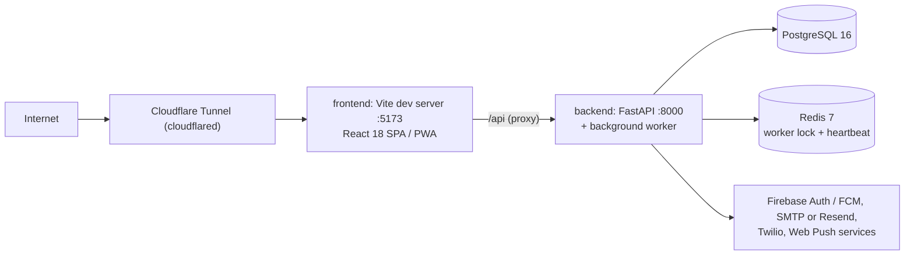

# Phase 34.5: Versioning, Documentation & Stabilization

**Why:** the platform grew fast through Phase 34. Before Phase 35 we:
* freeze it as a versioned release (**0.34.0**) that admins can see
* bring the docs up to date
* confirm the database schema file matches the models
* remove dead code
* make one set of words consistent
* close two real robustness gaps

**This is a stabilization sprint: no new features.**

## What this phase does (and what was already true)
Every item was checked against your current code before this prompt was written.

| Request | Finding | What this phase does |
|---|---|---|
| **1. Semantic versioning** | `package.json` said `0.2.0`. No version was shown anywhere. The API docs said a fixed `0.2.0`. | `frontend/package.json` → `0.34.0`. `vite.config.js` injects it as `__APP_VERSION__`. New `backend/src/version.py` holds the server's version. **Admin → System** shows *Web app 0.34.0 · Server 0.34.0* and warns if they differ (a stale container). A `v0.34.0` chip sits next to "Platform admin". New `CHANGELOG.md`. |
| **2. README** | Out of date (Nginx, a "trading shifts" matrix, none of Phases 27–34). | **Full replacement, provided below**, written from the current code: words we use, roles, features, architecture, the no-ENUM rule, setup, configuration, code rules, versioning. Use it exactly as given; don't write your own. |
| **3. `init.sql` audit** | Checked by machine: a fresh database was built from `init.sql` and compared with every SQLAlchemy model (tables, columns, types, nullability, foreign keys, unique constraints, indexes). **All 30 models match** and there are **no ENUMs**. Only three small gaps: `shifts.status` and `notification_deliveries.notification_id` are indexed in the models but not in `init.sql`, and `notification_preferences.quiet_start/quiet_end` are `Integer` in the model but `SMALLINT` in SQL. | Adds the two indexes. Makes the model `SmallInteger`. Rewrites the `init.sql` header to state the no-ENUM rule (the old header talked about "updating ENUM definitions"). Removes the unused SQLAlchemy `Enum` import so an ENUM column can't be added by accident. **Do NOT re-audit or rewrite `init.sql` yourself**: only the edits below. |
| **4. Roster deduplication** | **The request had these the wrong way round.** `EventRosterModal.jsx` is the live manager roster: it's used by the dashboard and was extended in Phase 34 (cover flags, waitlist). `ShiftRosterModal.jsx` is dead: nothing imports it. The same is true of `manager/TimeOffCard.jsx`. A full import-graph check found no other unused components, and the location / details modals each do a different job. | **Delete `ShiftRosterModal.jsx` and `manager/TimeOffCard.jsx`. Keep `EventRosterModal.jsx`** (its name already fits: it's an *event's* roster). Do NOT move roster code into `ShiftRosterModal`. |
| **4b. Event vs Shift words** | The UI called an event's role block a "position" and sometimes called a whole event a "shift" ("Post a shift", "Posted shifts", "Edit this shift"). | **Event** = the parent ("Post an event", "Posted events", "Edit this event"). **Shift** = one role and time block ("Shifts", "Add a shift", "Cancel shift", "This shift just filled up."). **Position** stays only for the job type in the venue catalog (*Venue settings → Positions & pay*, the "Position" dropdown when adding a shift, team members' positions). Exact edits below; API field names don't change. |
| **5a. Server-side geofencing** | **Already server-side since Phase 27.** `geo.js` only reads the phone's GPS. `services/clock.py` computes the Haversine distance and refuses far away or missing locations. **Real gap found:** `NaN` / `Infinity` coordinates crashed clock-in with a **500**. Out-of-range values (latitude 95) were accepted. The same `NaN` problem affects **every** JSON endpoint: a `NaN` pay rate was **saved** when posting an event. | Coordinates must be real, in-range numbers (422 otherwise), on clock-in / clock-out and the legacy check-in / check-out. A small middleware (`json_guard.py`) refuses `NaN` / `Infinity` in any JSON body with a clean 422. The frontend's error handler turns both into plain sentences. |
| **5b. Background worker** | **Already running:** `main.py`'s lifespan starts `notification_worker_loop()` with `asyncio.create_task()` (Phase 28), and Admin → System shows its heartbeat. | Documented in `docker-compose.yml` (comment above the backend service) and in the README. No code change. |
| **6. Standing directive** | | Final bold section of this prompt, **and** written into `agy_system_instructions.md` so it stays in the repo. |

## 0. Rules for this phase (read first)
* Do **NOT** touch:
  - `backend/src/auth.py`, `backend/src/routers/auth.py`, `backend/src/services/firebase.py`, `backend/src/services/always_admin.py`
  - `frontend/src/context/AuthContext.jsx`, `frontend/src/api/client.js`
  - the CORS block in `backend/src/main.py`
* **`main.py` changes are only the two edits shown:**
  - two imports
  - `version=APP_VERSION`
  - one `app.add_middleware(RejectNonFiniteJSON)` line placed **before** the CORS block, so CORS stays the outer layer
* **`vite.config.js`** is normally off-limits. It changes here only because you asked for the version injection. Add exactly the lines shown and keep everything else.
* **Schema:** two new indexes only; no tables or columns change. See Part G: a keep-your-data SQL is provided, or use the usual `docker compose down -v` / `up -d --build`.
* No new packages. No ENUMs. Aware UTC only.
* **NEW FILE / FULL FILE REPLACEMENT:** write exactly the content shown. **EDITS:** each edit is an exact *Find* → *Replace with*; every *Find* appears **exactly once** in the current file; apply them in order.
  - Some files use Windows line endings (CRLF). Match on the text and keep the file's line endings.
* **Verification.** All 37 edited files were checked against your repo and match (Phase 34 is fully applied). They were verified:
  - **Backend:** imports cleanly. Still **187** API operations. The API reports version **0.34.0**.
  - **Frontend:**
    - bundles with no missing imports
    - a **real Vite 5 build and the Vite dev server** both inject `0.34.0` (dev sets it on `globalThis` before the app runs)
    - an import-graph check shows no other unused files
  - **A new 28-check suite passes.** It covers:
    - the version (System tab, API docs, admin-only)
    - `NaN` / `Infinity` / out-of-range coordinates → 422 on clock-in, clock-out and both legacy routes
    - missing and far-away locations still refused by the server; on-site still works
    - a `NaN` pay rate refused and nothing saved; normal and broken JSON unchanged
    - the new wording in messages
    - the machine schema audit: 30/30 tables, no column / type / FK / index drift, no ENUMs
  - **All earlier suites still pass** (753 checks: 28, 20, 97, 36, 64, 67, 39, 49, 107, 32, 17, 24, 24, 96, plus the new 28).
  - **The keep-your-data SQL** was run twice on a copy of your current schema, and the result matches a fresh `init.sql` exactly.
  - In real Chromium: the admin header chip and System → Version row, "Post an event" with a **Shifts** section and **Add a shift**, the roster's **Edit this event / Cancel shift**, "Posted events", and the worker popup's **Shifts / Pick a shift**. No page errors.

  Don't "improve" them.

---

# PART A: Semantic versioning

## A1. NEW FILE `backend/src/version.py`

```python
"""
Phase 34.5: the app's version (Semantic Versioning, 0.<phase>.<sub-phase>).

Keep this equal to "version" in frontend/package.json. Both are bumped together at the end of every phase
(see CHANGELOG.md). The admin System tab shows both and warns when they differ, which usually means one
container is still running an old build.
"""
APP_VERSION = "0.34.0"
```

---

## A2. `backend/src/main.py` (EDITS)
Only these two edits. Edit 2 also adds the NaN / Infinity guard from Part D, **before** the CORS block, which stays exactly as it is.

**Edit 1.** Find:
```python
from src.routers.cover import router as cover_router       # Phase 34
from src.services.notification_worker import notification_worker_loop


```
Replace with:
```python
from src.routers.cover import router as cover_router       # Phase 34
from src.services.notification_worker import notification_worker_loop
from src.version import APP_VERSION                          # Phase 34.5
from src.json_guard import RejectNonFiniteJSON                # Phase 34.5


```

**Edit 2.** Find:
```python
    title="ShiftBoard API",
    description="Shift scheduling and community call-board platform for the service industry",
    version="0.2.0",
    lifespan=lifespan
)

# CORS middleware configuration
```
Replace with:
```python
    title="ShiftBoard API",
    description="Shift scheduling and community call-board platform for the service industry",
    version=APP_VERSION,                                     # Phase 34.5 (was a fixed "0.2.0")
    lifespan=lifespan
)

# Phase 34.5: refuse NaN / Infinity in JSON bodies (added BEFORE CORS so CORS stays the outer layer)
app.add_middleware(RejectNonFiniteJSON)

# CORS middleware configuration
```

---

## A3. `backend/src/schemas.py` (EDITS)
`AdminSystem.app_version`, plus the coordinate limits used in Part D (`ClockBody`, `CheckInRequest`, `CheckOutRequest`).

**Edit 1.** Find:
```python

class CheckInRequest(BaseModel):
    latitude: float
    longitude: float

class CheckOutRequest(BaseModel):
    latitude: float
    longitude: float

# ------------------------------------------------------------------------------
```
Replace with:
```python

class CheckInRequest(BaseModel):
    # Phase 34.5: same limits as ClockBody (these legacy routes build a ClockBody from them)
    latitude: float = Field(..., ge=-90, le=90, allow_inf_nan=False)
    longitude: float = Field(..., ge=-180, le=180, allow_inf_nan=False)

class CheckOutRequest(BaseModel):
    latitude: float = Field(..., ge=-90, le=90, allow_inf_nan=False)
    longitude: float = Field(..., ge=-180, le=180, allow_inf_nan=False)

# ------------------------------------------------------------------------------
```

**Edit 2.** Find:
```python

class ClockBody(BaseModel):
    latitude: Optional[float] = None
    longitude: Optional[float] = None
    accuracy_m: Optional[float] = None


```
Replace with:
```python

class ClockBody(BaseModel):
    # Phase 34.5: the server does the distance check, so the numbers must be real coordinates.
    # NaN / Infinity / out-of-range values are refused (422) instead of crashing the distance math (500).
    latitude: Optional[float] = Field(None, ge=-90, le=90, allow_inf_nan=False)
    longitude: Optional[float] = Field(None, ge=-180, le=180, allow_inf_nan=False)
    accuracy_m: Optional[float] = Field(None, ge=0, allow_inf_nan=False)


```

**Edit 3.** Find:
```python

class AdminSystem(BaseModel):
    app_base_url: str = ""
    app_base_url_ok: bool = False
```
Replace with:
```python

class AdminSystem(BaseModel):
    app_version: str = ""                    # Phase 34.5: the server's version (backend/src/version.py)
    app_base_url: str = ""
    app_base_url_ok: bool = False
```

---

## A4. `backend/src/routers/admin_console.py` (EDIT)
`GET /api/admin/system` returns `app_version`.

**Edit 1.** Find:
```python
        counts[label] = int(await db.scalar(select(func.count()).select_from(model)) or 0)

    return AdminSystem(
        app_base_url=settings.APP_BASE_URL or "", app_base_url_ok=_base_url_ok(),
        email_provider=(settings.EMAIL_PROVIDER or "console").lower(), email_from=settings.EMAIL_FROM or "",
```
Replace with:
```python
        counts[label] = int(await db.scalar(select(func.count()).select_from(model)) or 0)

    from src.version import APP_VERSION             # Phase 34.5
    return AdminSystem(
        app_version=APP_VERSION,
        app_base_url=settings.APP_BASE_URL or "", app_base_url_ok=_base_url_ok(),
        email_provider=(settings.EMAIL_PROVIDER or "console").lower(), email_from=settings.EMAIL_FROM or "",
```

---

## A5. `frontend/package.json` (EDIT)

**Edit 1.** Find:
```json
  "name": "shiftboard-frontend",
  "private": true,
  "version": "0.2.0",
  "type": "module",
  "scripts": {
```
Replace with:
```json
  "name": "shiftboard-frontend",
  "private": true,
  "version": "0.34.0",
  "type": "module",
  "scripts": {
```

---

## A6. `frontend/vite.config.js` (EDIT)
Reads `package.json` once when Vite starts and defines `__APP_VERSION__`. Everything else in this file stays as it is.

**Edit 1.** Find:
```js
import { defineConfig } from 'vite'
import react from '@vitejs/plugin-react'

// https://vitejs.dev/config/
export default defineConfig({
  plugins: [react()],
  resolve: {
    // Never allow two copies of React in the bundle ("Invalid hook call" / useRef of null)
```
Replace with:
```js
import { defineConfig } from 'vite'
import react from '@vitejs/plugin-react'
import { readFileSync } from 'node:fs'

// Phase 34.5: the app version comes from package.json ("version"), read once when Vite starts.
const packageJson = JSON.parse(readFileSync(new URL('./package.json', import.meta.url), 'utf-8'))

// https://vitejs.dev/config/
export default defineConfig({
  plugins: [react()],
  define: {
    // Replaced in the code at build / dev time. Read it through src/utils/version.js.
    __APP_VERSION__: JSON.stringify(packageJson.version),
  },
  resolve: {
    // Never allow two copies of React in the bundle ("Invalid hook call" / useRef of null)
```

---

## A7. NEW FILE `frontend/src/utils/version.js`
Always read the version through this file (never `__APP_VERSION__` directly), so a missing define can't crash the page.

```js
/* global __APP_VERSION__ */
/**
 * Phase 34.5: the web app's version, injected at build / dev-server start by vite.config.js
 * (define: __APP_VERSION__ from package.json "version"). "dev" only if something bundles the app without Vite.
 * Bumping the version means editing frontend/package.json AND backend/src/version.py, then restarting
 * the frontend container (Vite reads package.json once, at start).
 */
export const APP_VERSION = typeof __APP_VERSION__ !== 'undefined' ? __APP_VERSION__ : 'dev';
```

---

## A8. `frontend/src/components/admin/AdminSystem.jsx` (EDITS)
New **Version** row at the top of Configuration.

**Edit 1.** Find:
```jsx
import api from '../../api/client';
import { card, inputCls, btnGhost, btnPrimary, SectionTitle, ago, fmtDateTime } from './adminUi';

function Row({ state, label, children }) {
```
Replace with:
```jsx
import api from '../../api/client';
import { card, inputCls, btnGhost, btnPrimary, SectionTitle, ago, fmtDateTime } from './adminUi';
import { APP_VERSION } from '../../utils/version';   // Phase 34.5

function Row({ state, label, children }) {
```

**Edit 2.** Find:
```jsx
          />
          <div className="divide-y divide-slate-800">
            <Row state={sys.app_base_url_ok ? 'ok' : 'bad'} label="Public address (APP_BASE_URL)">
              {sys.app_base_url || 'Not set'}{!sys.app_base_url_ok && ' · links in emails, texts and invites will not open for people.'}
```
Replace with:
```jsx
          />
          <div className="divide-y divide-slate-800">
            {/* Phase 34.5: both halves should run the same release */}
            <Row state={sys.app_version && sys.app_version === APP_VERSION ? 'ok' : 'warn'} label="Version">
              Web app {APP_VERSION} · Server {sys.app_version || 'unknown'}
              {sys.app_version !== APP_VERSION && (
                <span className="block text-amber-300">
                  These should match. One of them is running an old build: run docker compose up -d --build, then hard-refresh this page.
                </span>
              )}
            </Row>
            <Row state={sys.app_base_url_ok ? 'ok' : 'bad'} label="Public address (APP_BASE_URL)">
              {sys.app_base_url || 'Not set'}{!sys.app_base_url_ok && ' · links in emails, texts and invites will not open for people.'}
```

---

## A9. `frontend/src/pages/AdminPanel.jsx` (EDITS)
The `v0.34.0` chip next to "Platform admin".

**Edit 1.** Find:
```jsx
import { Shield, LayoutDashboard, Building2, Users, History, Server, UserPlus, Plus } from 'lucide-react';
import api from '../api/client';
import VenueSettingsModal from '../components/VenueSettingsModal';
import AdminOverview from '../components/admin/AdminOverview';
```
Replace with:
```jsx
import { Shield, LayoutDashboard, Building2, Users, History, Server, UserPlus, Plus } from 'lucide-react';
import api from '../api/client';
import { APP_VERSION } from '../utils/version';   // Phase 34.5
import VenueSettingsModal from '../components/VenueSettingsModal';
import AdminOverview from '../components/admin/AdminOverview';
```

**Edit 2.** Find:
```jsx
              </div>
              <div>
                <h1 className="text-2xl font-black text-white">Platform admin</h1>
                <p className="text-xs text-slate-400 mt-0.5">Every venue, every account, and the health of the platform.</p>
              </div>
```
Replace with:
```jsx
              </div>
              <div>
                <h1 className="text-2xl font-black text-white flex items-center gap-2">
                  Platform admin
                  <span title="Web app version (details on the System tab)"
                    className="px-2 py-0.5 rounded-full text-[10px] font-bold bg-slate-800 text-slate-300 border border-slate-700">v{APP_VERSION}</span>
                </h1>
                <p className="text-xs text-slate-400 mt-0.5">Every venue, every account, and the health of the platform.</p>
              </div>
```

---

# PART B: Documentation

## B1. `README.md` (FULL FILE REPLACEMENT)
Replace the whole file with exactly this (it uses a four-backtick fence here because it contains code blocks).

````markdown
# ShiftBoard

> A shift scheduling and call-board platform for the service industry: venues post events, workers pick up shifts, and everyone knows who is working, where, and when.

**Version:** see `frontend/package.json` (web app) and `backend/src/version.py` (server). History is in [CHANGELOG.md](CHANGELOG.md).

[](https://fastapi.tiangolo.com)
[](https://www.python.org/)
[-61DAFB.svg?style=flat&logo=react)](https://react.dev/)
[](https://www.postgresql.org/)
[](https://www.docker.com/)

---

## Contents
1. [Words we use](#1-words-we-use)
2. [Roles](#2-roles)
3. [What it does](#3-what-it-does)
4. [Architecture](#4-architecture)
5. [Database rules](#5-database-rules)
6. [Running it](#6-running-it)
7. [Configuration](#7-configuration)
8. [Working on the code](#8-working-on-the-code)
9. [Versioning & releases](#9-versioning--releases)

---

## 1. Words we use
These are the words in the app. Use them in code comments, docs and every new screen.

| Word | Meaning | Example | In the code |
| :--- | :--- | :--- | :--- |
| **Event** | The parent: one thing happening at one time and place. | *Saturday Banquet, 5 PM to 1 AM* | `ShiftEvent` / `shift_events` |
| **Shift** | One role and time block inside an event, with a number of spots. | *Bartender, 5 PM to 1 AM, 3 spots* | `Shift` / `shifts` (the `role_type` column holds the position name) |
| **Position** | A job type in the venue's catalog, with default pay. | *Bartender at $28/hr* | `VenuePosition` / `venue_positions` |
| **Booking / request** | One person on one shift, waiting or booked. | *Ava is booked as Bartender* | `ShiftRequest` / `shift_requests` |
| **Hand-off** | A booked worker gives their shift to a named teammate. | | `ShiftTransfer` / `shift_transfers` |
| **Cover request** | A booked worker asks their team (or the public board) to take their shift. | | `CoverRequest` / `cover_requests` |
| **Waitlist** | A line for a full shift. | | `WaitlistEntry` / `waitlist_entries` |
| **Offer** | A manager offers a shift to one or more people; the first to accept gets it. | | `ShiftOffer` / `shift_offers` |

Many API fields still say `positions` for an event's shifts (for example `EventListing.positions[]`). That's a historical name: the UI says **shifts**.

---

## 2. Roles
Every account has exactly one role, stored as plain text in `users.role`.

| Role | Key | Home page | What they do |
| :--- | :--- | :--- | :--- |
| **Platform Admin** | `platform_admin` | `/admin` | Everything, across every venue. The admin console has Overview, Venues, Users, Activity and System tabs. Admins can switch into any venue's manager view, and see the worker view. |
| **Venue Manager** | `venue_manager` | `/venue` | Runs one or more venues: posts events, approves requests and hand-offs, staffs shifts, manages the team, edits time sheets, and downloads hours. |
| **Worker** | `worker` | `/worker` | Finds and requests shifts, clocks in and out, hands off, asks for cover, joins waitlists, and tracks hours and pay. |

Access is enforced on the server by dependencies in `backend/src/auth.py` (`get_current_user`, `require_role(...)` and its shortcuts `require_admin`, `require_manager_or_admin`, `require_worker`, plus `verify_venue_access`. Admins pass every role check). In the browser, `<ProtectedRoute allowedRoles={[...]}>` does the same. Emails listed in `ALWAYS_ADMIN_EMAILS` are always promoted to admin, so you can't get locked out.

---

## 3. What it does

### Signing in
* **Email and password**: bcrypt hashes (`passlib`), HS256 JWTs (`python-jose`). The frontend keeps the token and an Axios interceptor adds it to every call.
* **Google / Firebase sign-in with just-in-time accounts**: the backend verifies the Firebase ID token with `firebase-admin` (`POST /api/auth/firebase-login`), then matches the account in this order:
  1. by Firebase UID;
  2. by verified email, linking the UID to that existing account (which keeps its role);
  3. otherwise it creates a **worker** account on the spot. This needs a verified email and `ALLOW_SELF_REGISTRATION=true`. Emails in `ALWAYS_ADMIN_EMAILS` become admins.
* Mock Firebase mode (`USE_MOCK_FIREBASE=true`) for local testing without Google.
* Invites: managers invite people by email, link or QR code. Joining through an invite adds them to the venue team.

### For workers
* **Find shifts**: upcoming events, grouped by day, with filters:
  * date
  * position
  * venue
  * instant book
  * fits my availability
  * only my departments

  At the top, **Need cover**: teammates' shifts they can take. At the bottom, **Full: join a waitlist**.
* **Booking rules** (same everywhere, `services/auto_confirm.py`):
  * The shift's own setting comes first. Then the venue policy decides:
    * **Book my team instantly**: team members are booked right away; everyone else waits for a manager.
    * **I approve everyone**
    * **Book anyone instantly**
  * An optional rating threshold also books highly rated people instantly.
  * Shifts outside the worker's departments, and asking back after a drop, always need a manager.
* One request per event. Double-booking is refused. Certificates (e.g. an alcohol server card) are checked, including expiry dates.
* **My shifts**:
  * clock in / out (with a location check when the venue uses it)
  * shift notes and "read the update" acknowledgements
  * shift chat, directions, add to calendar
  * hand off, **ask for cover**, drop
  * offers from managers and waitlist offers (with a countdown)
* **Dropping**: allowed until 24 hours before the start. A drop with less than 72 hours' notice counts as a late drop for reliability. Workers can ask to come back; a manager has to approve it.
* **Hand-offs**: to a named teammate who is free. The teammate accepts, then the manager approves.
* **Cover requests** (Phase 34):
  * The worker asks their team, or their team plus the public board (if the venue allows it). They stay booked until someone takes it.
  * Taking it follows the venue's usual booking rules.
  * If nobody takes it, the worker and managers are warned 12 h and 3 h before the start. Asking for cover never counts against reliability.
* **Waitlists** (Phase 34): people join the line for a full shift. When a spot opens, the next person is either booked automatically or offered the spot for 30 minutes (10 minutes when the shift starts within 3 hours). A spot on offer is held for that person.
* **Calendar**, **Hours & pay** (weekly totals, per venue, CSV download), and a **profile** with:
  * photo, phone, emergency contact
  * departments, positions
  * weekly availability and time off
  * certificates (uploaded and verified by managers)

### For managers
* **Today / This week board**:
  * who's booked, clocked in, late or missing
  * open spots
  * unread updates
  * one-tap actions (assign, offer, message)
* **Posting events**:
  * one event with several shifts, each with its own pay (hourly or a range), tips / tip pool, notes, staff-only notes and approval setting
  * drafts, templates, copies to other dates (series)
  * saved locations (off-site events)
* **Requests to review** and **Hand-offs to approve**. Cover takes that need approval appear in the hand-off list with a **Cover** tag.
* **Staffing**:
  * assign someone directly
  * offer a shift to several people (first to accept gets it)
  * book back someone who dropped
  * remove someone, mark a no-show
* **Team**: members, positions, notes, blocking, invites (email / link / QR / CSV), ratings and reviews.
* **Time sheets**: fix clock-in / clock-out times (every edit is logged). Download hours and pay as CSV in the venue's time zone.
* **Reliability scoring** (`services/reliability.py`):
  * The score is `100 × (on-time + ½ × late) ÷ (worked + no-shows + late drops)`, across the whole platform.
  * Late means clocking in more than 10 minutes after the start.
  * Drops with 72 hours' notice or more are excused.
  * Managers see it as a badge next to each person.
* **Activity log** of every booking, change and approval. **Venue settings**:
  * address, clock-in area, clock-in rules
  * approval policy, public cover
  * positions & pay, locations, templates

### Clock-in location check (geofencing)
* The browser only sends coordinates (`frontend/src/utils/geo.js`). The server decides (`backend/src/services/clock.py`):
  * It computes the Haversine distance to the venue or the event's location.
  * Inside the radius: **on site**.
  * Within the extra buffer: allowed but flagged **outside the area**.
  * Farther away: **refused**.
  * No location while the check is on: **refused**.
* Coordinates must be real numbers in range. NaN / Infinity / out-of-range values are refused with a 422.
* Off by default per venue. Each event can turn it on or off.

### Notifications
* **In the app** (bell), **email** (console, SMTP or Resend), **text** (Twilio; urgent items only, if the person turned texts on) and **phone / browser push**:
  * Firebase Cloud Messaging when it's configured
  * otherwise ShiftBoard's own Web Push via `pywebpush` / VAPID (keys are made automatically and stored in the `app_keys` table)
* People choose channels and quiet hours. New-shift alerts can be instant, a daily digest, or off.
* The app installs as a **PWA** (manifest, service worker `public/sw.js`, offline page).

### Background worker
* Runs inside the backend container: `backend/src/main.py` starts `notification_worker_loop()` from the FastAPI lifespan with `asyncio.create_task()`.
* Every minute:
  * auto clock-out
  * 24 h / 2 h reminders
  * "not clocked in" alerts
  * unread-update alerts
  * unfilled-shift alerts
  * certificate expiry reminders
  * cover request warnings and clean-up
  * the waitlist line
  * email / text / push delivery with retries
* A Redis lock means only one process runs each tick.
* Admin → System shows its heartbeat. `NOTIFICATIONS_WORKER_ENABLED=false` turns it off (only for extra API replicas).

---

## 4. Architecture



| Layer | Stack |
| :--- | :--- |
| **Frontend** | React 18, Vite 5, Tailwind CSS 3, React Router 6, Axios, jwt-decode, react-big-calendar, date-fns, lucide-react, Firebase JS SDK (sign-in / messaging) |
| **Backend** | Python 3.11, FastAPI, SQLAlchemy 2 (async, `asyncpg`), Pydantic v2, passlib[bcrypt], python-jose, firebase-admin, pywebpush / py-vapid, redis |
| **Data** | PostgreSQL 16 (schema in `database/init.sql`), Redis 7 |
| **Infrastructure** | Docker Compose (`database`, `redis`, `backend`, `frontend`, `cloudflared`). Secrets live in `.secrets/` (git-ignored) and are mounted read-only. |

The frontend container runs the Vite dev server with hot reload. Vite proxies `/api` to `backend:8000`, and the Cloudflare tunnel points at the frontend.

**Code map**
```text
backend/src/
  main.py            app, CORS, routers, lifespan (seed + background worker)
  auth.py            JWT + role checks            (locked: change only when asked)
  version.py         the server's version (keep equal to frontend/package.json)
  models.py          SQLAlchemy models             (every table is also in database/init.sql)
  schemas.py         Pydantic request / response models
  routers/           one file per area (auth, venues, events, shifts, listings, transfers, cover, team, ...)
  services/          the logic (booking, auto_confirm, clock, cover, waitlist, reliability, notify*, ...)
frontend/src/
  pages/             WorkerDashboard, VenueManagerDashboard, AdminPanel, EarningsPage, ProfilePage, ...
  components/        shared UI; admin/, manager/, worker/, profile/ sub-folders
  context/AuthContext.jsx, api/client.js   (locked: change only when asked)
  utils/             formatting, time zones, errors, push, version
database/init.sql    the whole schema (runs on an empty database)
```

API docs are live at `/docs` (Swagger) and `/redoc` on the backend.

---

## 5. Database rules

> **No native PostgreSQL ENUMs are used.** All status and role columns are plain `VARCHAR`: the core `user_role`, `request_status`, `shift_status` and `transfer_status` columns are `VARCHAR(50)`. They are validated in the application by Pydantic models and Python `Enum` classes. The `asyncpg` driver couldn't cast Python strings to native ENUMs, which caused 500 errors, so never write `CREATE TYPE ... AS ENUM` and never use SQLAlchemy's `Enum` column type.

* **Every model in `backend/src/models.py` has a matching `CREATE TABLE` in `database/init.sql`**: same columns, types, nullability, foreign keys and indexes. Change both together.
* **Time:** all timestamps are `TIMESTAMPTZ`, and all comparisons in Python use timezone-aware UTC (`datetime.now(timezone.utc)`). Venue-local times are only for display and exports.
* **There is no migration tool.** `init.sql` only runs on an empty database. To apply a schema change, pick one:
  * wipe and rebuild: `docker compose down -v`, then `docker compose up -d --build`
  * or run that phase's "keep your data" SQL (`ALTER TABLE ... ADD COLUMN IF NOT EXISTS`, `CREATE ... IF NOT EXISTS`)

---

## 6. Running it

**You need:** Docker Desktop (Compose v2) and git.

```bash
# 1. Settings (copy the templates, then fill in real values)
cp .env.template .env
cp .secrets/.secrets.env.template .secrets/.secrets.env
cp backend/.env.template backend/.env        # optional
cp frontend/.env.template frontend/.env      # optional

# 2. Build and start (first time, or after a schema change)
docker compose down -v
docker compose up -d --build

# 3. Check
docker compose ps
docker compose logs -f backend
```

| Service | Address |
| :--- | :--- |
| Web app | http://localhost:5173 (also on `PORT_FRONTEND`, default 80) |
| API + docs | http://localhost:8000/docs |
| PostgreSQL | `localhost:5432` |
| Redis | `localhost:6379` |

**Demo accounts** (created on first start; the login page shows buttons for them when `SHOW_DEMO_LOGINS=true`):

| Role | Email | Password |
| :--- | :--- | :--- |
| Platform Admin | `demo_admin@shiftboard.com` | `SuperSecretDemo123!` (or `SUPER_ADMIN_PASSWORD`) |
| Venue Manager | `demo_manager@shiftboard.com` | `DemoManager123!` |
| Worker | `demo_worker@shiftboard.com` | `DemoWorker123!` |
| Worker | `worker1@shiftboard.com`, `worker2@shiftboard.com` | `Worker123!` |

Change these before anyone else can reach the app.

**Everyday commands**
```bash
docker compose up -d --build                  # after pulling changes (keeps data)
docker compose restart frontend               # after changing package.json "version" (Vite reads it at start)
docker compose exec frontend rm -rf node_modules/.vite && docker compose restart frontend   # blank page / "Invalid hook call"
docker compose down -v && docker compose up -d --build                                     # wipe the database and start fresh
```

---

## 7. Configuration
Real values go in `.secrets/.secrets.env` (git-ignored). The templates list every setting. The main ones:

| Area | Settings |
| :--- | :--- |
| Database / Redis | `POSTGRES_USER`, `POSTGRES_PASSWORD`, `POSTGRES_DB`, `REDIS_PASSWORD` |
| Sign-in | `SECRET_KEY` / `JWT_SECRET_KEY`, `JWT_ACCESS_TOKEN_EXPIRE_MINUTES`, `SUPER_ADMIN_USERNAME`, `SUPER_ADMIN_PASSWORD`, `ALWAYS_ADMIN_EMAILS`, `ALLOW_SELF_REGISTRATION`, `SHOW_DEMO_LOGINS` |
| Firebase | `USE_MOCK_FIREBASE`, `FIREBASE_PROJECT_ID`, `FIREBASE_CREDENTIALS_PATH` (`.secrets/firebase_service_account.json`), `FIREBASE_WEB_CONFIG_PATH` (`.secrets/firebase-web-config.js`), `FIREBASE_AUTH_PROVIDERS`, `FIREBASE_VAPID_KEY` (push through FCM) |
| Links | `APP_BASE_URL`: the public address used in emails, texts and invites |
| Email | `EMAIL_PROVIDER` (`console` \| `smtp` \| `resend`), `EMAIL_FROM`, `SMTP_*`, `RESEND_API_KEY` |
| Texts | `SMS_PROVIDER` (`off` \| `console` \| `twilio`), `TWILIO_ACCOUNT_SID`, `TWILIO_AUTH_TOKEN`, `TWILIO_FROM_NUMBER` |
| Push | `VAPID_PRIVATE_KEY` (optional; otherwise generated and stored in the database) |
| Background worker | `NOTIFICATIONS_WORKER_ENABLED` (default `true`), `NOTIFICATIONS_DIGEST_HOUR` |
| Files | `R2_*` (Cloudflare R2, optional) |
| Tunnel | `CLOUDFLARE_TUNNEL_TOKEN` |

Admin → System shows what's configured, what's missing and whether the background worker is running.

---

## 8. Working on the code
Changes are planned as numbered **phases**. The prompts are written against the current files and applied by the coding agent (AGY). These rules always apply:

1. **No native PostgreSQL ENUMs** (see section 5).
2. **Sign-in is locked.** Don't refactor these unless the phase explicitly says to:
   * `backend/src/auth.py`, `backend/src/routers/auth.py`, `backend/src/services/firebase.py`, `backend/src/services/always_admin.py`
   * the CORS setup in `backend/src/main.py`
   * `frontend/src/context/AuthContext.jsx`, `frontend/src/api/client.js`
3. **Timezone-aware UTC** for every datetime comparison.
4. **Schema changes** update `models.py` and `init.sql` together, and ship the rebuild reminder (`docker compose down -v` / `up -d --build`) plus "keep your data" SQL.
5. **Error handling:** raise `HTTPException` validation errors before the generic `try/except`, and call `await db.rollback()` in every `except`. Notifications and activity logging run after the commit and never raise.
6. **Words:** Event → Shift → Position, as in section 1.
7. **No new packages** unless the phase says so.
8. **Every phase ends with a version bump and a CHANGELOG entry** (section 9).

---

## 9. Versioning & releases
ShiftBoard uses [Semantic Versioning](https://semver.org/). While it's pre-1.0, the version follows the phase number:

| Phase | Version |
| :--- | :--- |
| Phase 34 (feature freeze) | `0.34.0` |
| Phase 35 | `0.35.0` |
| Phase 35.1 | `0.35.1` |
| Phase 35.1.1 (or 35.0.1) | `0.35.2` (the next patch number) |

**The version lives in two places. Keep them equal:**
* `frontend/package.json` → `"version"`
  * `frontend/vite.config.js` injects it as `__APP_VERSION__`
  * read it through `frontend/src/utils/version.js`
* `backend/src/version.py` → `APP_VERSION`
  * shown in the API docs and on Admin → System

Admin → System shows both and warns when they differ (one container is running an old build). Admins also see the web app version next to "Platform admin".

**At the end of every phase:**
1. Bump both version numbers.
2. Add a section at the top of [CHANGELOG.md](CHANGELOG.md): `## [x.y.z] - YYYY-MM-DD - Phase N: title`, followed by bullets.
3. Update this README if the architecture, roles, rules or setup changed.
4. Restart the frontend container so Vite picks up the new version.
````

---

## B2. NEW FILE `CHANGELOG.md` (project root)

````markdown
# Changelog

All notable changes to ShiftBoard. The format follows [Keep a Changelog](https://keepachangelog.com/en/1.1.0/), and versions follow [Semantic Versioning](https://semver.org/): while pre-1.0, **0.&lt;phase&gt;.&lt;sub-phase&gt;** (see README → Versioning & releases).

The newest version goes at the top. Each entry uses a `## [x.y.z] - YYYY-MM-DD - Phase N: title` heading, followed by bullets under **Added / Changed / Fixed / Removed**.

## [0.34.0] - Phase 34 Feature Freeze

The first versioned release. It captures the platform as of Phase 34, plus the Phase 34.5 stabilization sprint.

### Platform at the freeze
- **Roles:** Platform Admin, Venue Manager and Worker, with server-side role checks.
- **Sign-in:**
  - email / password (bcrypt + JWT)
  - Google / Firebase sign-in with just-in-time worker accounts
  - always-admin emails
  - invites by email, link, QR code or CSV
- **Events and shifts:**
  - one event holds several shifts, each with its own pay (or a pay range), tips, notes, staff-only notes and approval setting
  - drafts, templates, copies to other dates (series)
  - saved off-site locations
- **Booking:** the auto-confirm engine (the shift's setting, then the venue policy: team, everyone or manual, plus a rating threshold). It also checks:
  - one request per event
  - double-booking
  - certificates, with expiry dates
  - departments
  - availability and time off
- **Workers:**
  - Find shifts, My shifts, Calendar, Hand-offs, Hours & pay
  - clock in / out with an optional server-side location check
  - drop (24 h rule; late drop under 72 h) and ask to come back
  - hand-offs, **cover requests** (team or public board), **waitlists** (auto-book or timed offers)
  - profile: availability, time off, certificates, departments
- **Managers:**
  - Today / This week board
  - requests and hand-off queues
  - assign, offer (first to accept), book back, remove, no-show
  - team management, ratings and reviews, **reliability scores**
  - time sheets with an edit log, hours / payroll CSV in venue time
  - activity log and venue settings
- **Admins:** Overview, Venues, Users, Activity and System tabs, plus a worker view and switching into any venue.
- **Notifications:** in-app, email (console / SMTP / Resend), text (Twilio) and phone / browser push (Firebase Cloud Messaging, or Web Push via VAPID). Quiet hours and digests. PWA install and an offline page.
- **Background worker** (inside the backend, started by the FastAPI lifespan):
  - reminders and alerts
  - auto clock-out
  - cover warnings and the waitlist line
  - delivery with retries
  - a Redis lock and heartbeat

### Added (Phase 34.5 stabilization)
- Semantic versioning.
  - `frontend/package.json` version `0.34.0`, injected into the app by `vite.config.js` as `__APP_VERSION__` (read through `src/utils/version.js`).
  - `backend/src/version.py` holds the server version, also used by the API docs.
  - Admin → System shows both and warns if they differ. Admins see the version next to "Platform admin".
- This changelog.
- Database indexes on `notification_deliveries(notification_id)` and `shifts(status)`, matching the models.

### Changed (Phase 34.5 stabilization)
- `README.md` rewritten for the current system: words we use, roles, features, architecture, the no-ENUM rule, setup, configuration, and the release process.
- UI and messages use one set of words:
  - **Event** is the parent ("Post an event", "Posted events").
  - **Shift** is one role and time block in it ("Add a shift", "Cancel shift", "This shift just filled up").
  - **Position** stays the job type in Venue settings → Positions & pay.
- `notification_preferences.quiet_start` / `quiet_end` are `SmallInteger` in the model, matching the `SMALLINT` columns in `init.sql`.
- `database/init.sql` header states the no-ENUM rule. `docker-compose.yml` documents where the background worker runs.

### Fixed (Phase 34.5 stabilization)
- Clock-in / clock-out with `NaN`, `Infinity` or out-of-range coordinates crashed the server's distance check (500). They're now refused with a clear message (422).

### Removed (Phase 34.5 stabilization)
- `frontend/src/components/ShiftRosterModal.jsx` and `frontend/src/components/manager/TimeOffCard.jsx`: unused (nothing imported them). The manager roster is `EventRosterModal.jsx`.
- The unused SQLAlchemy `Enum` import in `models.py`, so no native ENUM column can be added by accident.
````

---

## B3. `agy_system_instructions.md` (EDIT)
Adds the **Standing rules** section at the end (the directive from the last part of this prompt, plus how to apply it), so it stays in the repo.

**Edit 1.** Find:
```markdown
2.  Create the `.gitignore` and all `.env.template` files with placeholder variables (including Firebase, Cloudflare R2 S3 endpoints/keys, Postgres credentials).
3.  Generate the `init.sql` schema to support the Users, Venues, Shifts, ShiftRequests, Whitelists, and Ratings tables.
```
Replace with:
```markdown
2.  Create the `.gitignore` and all `.env.template` files with placeholder variables (including Firebase, Cloudflare R2 S3 endpoints/keys, Postgres credentials).
3.  Generate the `init.sql` schema to support the Users, Venues, Shifts, ShiftRequests, Whitelists, and Ratings tables.
---

## Standing rules (added in Phase 34.5, apply to every phase)

**CRITICAL SYSTEM DIRECTIVE: Starting immediately, upon the successful completion of any future phase or feature implementation, you must autonomously bump the version number in `frontend/package.json`, append a bulleted summary of changes to `CHANGELOG.md`, and update `README.md` if the architecture changed. Do not ask for permission to do this.**

How to follow it:
1. **Which number:** while pre-1.0 the version follows the phase: Phase N → `0.N.0`, Phase N.x → `0.N.x`; a third level (N.x.y) takes the next patch number. If the phase prompt names the version, use exactly that one.
2. **Both places, same number:** `frontend/package.json` → `"version"` AND `backend/src/version.py` → `APP_VERSION`. Admin → System warns when they differ.
3. **CHANGELOG.md:** add the new section at the TOP (under the intro), as `## [x.y.z] - YYYY-MM-DD - Phase N: title`, with bullets under Added / Changed / Fixed / Removed. Never edit older sections.
4. **README.md:** update it when the architecture, roles, rules, configuration or setup changed. Otherwise leave it.
5. Do this only after the phase's own changes are complete and verified, and include these files in your summary of changed files. The frontend container must be restarted to show a new version (Vite reads package.json at start).

The project rules that always apply are in README.md → "Working on the code" (no native PostgreSQL ENUMs, locked sign-in files, timezone-aware UTC, schema changes in models.py AND database/init.sql, Event → Shift → Position wording).
```

---

## B4. `docker-compose.yml` (EDIT)
Comment only: where the background worker runs. No service changes.

**Edit 1.** Find:
```yaml
  # ----------------------------------------------------------------------------
  # Backend API (Python / FastAPI)
  # ----------------------------------------------------------------------------
  backend:
```
Replace with:
```yaml
  # ----------------------------------------------------------------------------
  # Backend API (Python / FastAPI)
  #
  # The background worker runs INSIDE this container: the FastAPI lifespan in
  # backend/src/main.py starts it with asyncio.create_task() (no separate service).
  # Every minute it sends reminders and alerts, runs cover requests and waitlists,
  # auto clocks-out, and delivers email / text / push. A Redis lock makes sure only
  # one process runs each tick. Health: Admin -> System -> Background worker.
  # Set NOTIFICATIONS_WORKER_ENABLED=false (in .secrets/.secrets.env) only if you
  # add extra API replicas that should not run it.
  # ----------------------------------------------------------------------------
  backend:
```

---

# PART C: Schema synchronization

## C1. `database/init.sql` (EDITS)
New header with the rules, plus two indexes the models already declare. **No other changes to this file.**

**Edit 1.** Find:
```sql
-- ShiftBoard Database Initialization Schema
-- PostgreSQL 16
-- 
-- NOTE: If updating ENUM definitions or database constraints, wipe the existing
-- Docker database volume to apply changes:
--   docker compose down -v
--   docker compose up --build
-- ==============================================================================

```
Replace with:
```sql
-- ShiftBoard Database Initialization Schema
-- PostgreSQL 16
--
-- RULES (Phase 34.5):
--   * NO native PostgreSQL ENUMs. Never write CREATE TYPE ... AS ENUM. Every status / role
--     column is a plain VARCHAR (the core user_role, request_status, shift_status and
--     transfer_status columns are VARCHAR(50)); allowed values are checked in the app
--     (Pydantic + Python Enum classes). The asyncpg driver can't cast to native ENUMs.
--   * Every model in backend/src/models.py has its CREATE TABLE here, with the same
--     columns, types, nullability, foreign keys and indexes. Change both together.
--   * This file only runs on an EMPTY database. To apply a change, either wipe it:
--       docker compose down -v
--       docker compose up -d --build
--     or run the phase's "keep your data" SQL (ALTER TABLE ... / CREATE ... IF NOT EXISTS).
-- ==============================================================================

```

**Edit 2.** Find:
```sql

CREATE INDEX idx_shifts_venue ON shifts(venue_id);
CREATE INDEX idx_shifts_start_time ON shifts(start_time);
CREATE INDEX idx_shifts_role_type ON shifts(role_type);
```
Replace with:
```sql

CREATE INDEX idx_shifts_venue ON shifts(venue_id);
CREATE INDEX idx_shifts_status ON shifts(status);                                  -- Phase 34.5 (matches the model)
CREATE INDEX idx_shifts_start_time ON shifts(start_time);
CREATE INDEX idx_shifts_role_type ON shifts(role_type);
```

**Edit 3.** Find:
```sql
);
CREATE INDEX idx_notification_deliveries_due ON notification_deliveries(status, send_after);

CREATE TABLE notification_preferences (
```
Replace with:
```sql
);
CREATE INDEX idx_notification_deliveries_due ON notification_deliveries(status, send_after);
CREATE INDEX idx_notification_deliveries_notification ON notification_deliveries(notification_id);   -- Phase 34.5 (FK lookups / cascades)

CREATE TABLE notification_preferences (
```

---

## C2. `backend/src/models.py` (EDITS)
Removes the unused SQLAlchemy `Enum` import (no native ENUMs, ever), and makes the quiet-hours columns `SmallInteger` to match `init.sql`.

**Edit 1.** Find:
```python
from sqlalchemy import (
    Column, String, Text, Boolean, Integer, Float, Numeric,
    DateTime, ForeignKey, Enum as SQLEnum, ARRAY, CheckConstraint, UniqueConstraint,
    Date, SmallInteger, LargeBinary,
)
```
Replace with:
```python
from sqlalchemy import (
    Column, String, Text, Boolean, Integer, Float, Numeric,
    DateTime, ForeignKey, ARRAY, CheckConstraint, UniqueConstraint,   # Phase 34.5: no SQLAlchemy Enum (no native PG ENUMs)
    Date, SmallInteger, LargeBinary,
)
```

**Edit 2.** Find:
```python
    manager_alerts_email = Column(Boolean, nullable=False, default=True)
    push_enabled = Column(Boolean, nullable=False, default=True)             # Phase 33: phone / browser notifications
    quiet_start = Column(Integer, nullable=True)                             # hour 0-23
    quiet_end = Column(Integer, nullable=True)
    timezone = Column(String(64), nullable=False, default="America/New_York")
    updated_at = Column(DateTime(timezone=True), default=datetime.utcnow, onupdate=datetime.utcnow, nullable=False)
```
Replace with:
```python
    manager_alerts_email = Column(Boolean, nullable=False, default=True)
    push_enabled = Column(Boolean, nullable=False, default=True)             # Phase 33: phone / browser notifications
    quiet_start = Column(SmallInteger, nullable=True)                        # hour 0-23 (Phase 34.5: SMALLINT, as in init.sql)
    quiet_end = Column(SmallInteger, nullable=True)
    timezone = Column(String(64), nullable=False, default="America/New_York")
    updated_at = Column(DateTime(timezone=True), default=datetime.utcnow, onupdate=datetime.utcnow, nullable=False)
```

---

# PART D: Robustness (clock-in coordinates, NaN / Infinity)

## D1. NEW FILE `backend/src/json_guard.py`
Registered in A2. It only reads `application/json` bodies of POST / PUT / PATCH; everything else passes through untouched.

```python
"""
Phase 34.5: refuse JSON request bodies that contain NaN / Infinity / -Infinity.

They aren't valid JSON, but Python's json module (which FastAPI uses) accepts them, and then:
  * a float field with limits (e.g. latitude between -90 and 90) fails validation, and FastAPI's own 422
    handler crashes trying to echo NaN back as JSON  -> a 500 instead of a clear error;
  * a float field without limits (e.g. a pay rate) quietly saves NaN in the database.
This ASGI middleware checks POST / PUT / PATCH bodies sent as application/json once, before any route runs,
and answers 422 in the same shape FastAPI uses (the frontend's friendly-error handler turns it into a sentence).
Everything else passes through untouched (the body is replayed to the app exactly as received).
"""
import json

from starlette.responses import JSONResponse

_BAD = ("NaN", "Infinity", "-Infinity")
_METHODS = ("POST", "PUT", "PATCH")


class _NonFinite(ValueError):
    pass


def _refuse(token: str):
    raise _NonFinite(token)


class RejectNonFiniteJSON:
    def __init__(self, app):
        self.app = app

    async def __call__(self, scope, receive, send):
        if scope["type"] != "http" or scope.get("method") not in _METHODS:
            return await self.app(scope, receive, send)
        ctype = ""
        for k, v in scope.get("headers") or []:
            if k == b"content-type":
                ctype = v.decode("latin-1").lower()
                break
        if "json" not in ctype:
            return await self.app(scope, receive, send)

        # Read the whole body once
        body = b""
        first_other = None
        while True:
            message = await receive()
            if message["type"] != "http.request":
                first_other = message          # e.g. http.disconnect: hand it on unchanged
                break
            body += message.get("body", b"")
            if not message.get("more_body", False):
                break

        if body and first_other is None:
            try:
                json.loads(body, parse_constant=_refuse)
            except _NonFinite as e:
                response = JSONResponse(status_code=422, content={"detail": [{
                    "type": "finite_number",
                    "loc": ["body"],
                    "msg": f"Numbers must be real numbers ({e} isn't allowed).",
                    "input": None,
                }]})
                return await response(scope, receive, send)
            except ValueError:
                pass                                   # other bad JSON: FastAPI reports it as usual

        sent = False

        async def replay():
            nonlocal sent
            if not sent:
                sent = True
                if first_other is not None:
                    return first_other
                return {"type": "http.request", "body": body, "more_body": False}
            return await receive()

        await self.app(scope, replay, send)
```

---

## D2. `frontend/src/utils/apiErrors.js` (EDIT)
Plain sentences for refused coordinates and for NaN / Infinity.

**Edit 1.** Find:
```js
  const type = String(first.type || '');
  const limit = first.ctx && (first.ctx.max_length ?? first.ctx.le ?? first.ctx.lt);
  if (type === 'missing') return field ? `Please fill in the ${field}.` : 'Please fill in every required field.';
  if (field === 'email address' || type.includes('email')) return 'Please enter a valid email address.';
```
Replace with:
```js
  const type = String(first.type || '');
  const limit = first.ctx && (first.ctx.max_length ?? first.ctx.le ?? first.ctx.lt);
  if (['latitude', 'longitude', 'accuracy m'].includes(field)) {   // Phase 34.5: clock-in coordinates the server refused
    return "Your phone sent a location we can't use. Turn location off and on again, then try again.";
  }
  if (type === 'finite_number') return 'Please check the numbers you entered.';   // Phase 34.5: NaN / Infinity refused
  if (type === 'missing') return field ? `Please fill in the ${field}.` : 'Please fill in every required field.';
  if (field === 'email address' || type.includes('email')) return 'Please enter a valid email address.';
```

---

# PART E: One set of words (Event → Shift → Position)

**Event** = the parent (*Saturday Banquet*). **Shift** = one role and time block in it (*Bartender, 5 PM–1 AM, 3 spots*). **Position** = only the job type in the venue catalog (Venue settings → Positions & pay, the Position dropdown, team members' positions).
Only user-facing text changes. **Don't rename API fields, variables, props, files or database columns** (`positions`, `role_type`, `onCancelPosition`, `StaffPositionModal` etc. all stay).

---

## E1. `backend/src/services/booking.py` (EDITS)

**Edit 1.** Find:
```python
REREQUESTABLE_STATUSES = ("withdrawn", "dropped")      # Phase 29.4: dropped = ask to come back
BLOCKED_MESSAGES = {
    "rejected": "The venue already passed on your request for this position. You can request a different position.",
    "removed": "The venue removed you from this shift.",
    "no_show": "You were marked as a no-show for this shift.",
    "cancelled": "This position was cancelled.",
    "transferred": "You handed this shift off earlier.",
}
```
Replace with:
```python
REREQUESTABLE_STATUSES = ("withdrawn", "dropped")      # Phase 29.4: dropped = ask to come back
BLOCKED_MESSAGES = {
    "rejected": "The venue already passed on your request for this shift. You can request a different one.",
    "removed": "The venue removed you from this shift.",
    "no_show": "You were marked as a no-show for this shift.",
    "cancelled": "This shift was cancelled.",
    "transferred": "You handed this shift off earlier.",
}
```

**Edit 2.** Find:
```python
    shift = await db.scalar(select(Shift).where(Shift.id == shift_id))
    if not shift:
        raise HTTPException(status_code=404, detail="Position not found.")
    if shift.event_id:
        # Lock the event first so every request for this event is handled one at a time.
```
Replace with:
```python
    shift = await db.scalar(select(Shift).where(Shift.id == shift_id))
    if not shift:
        raise HTTPException(status_code=404, detail="Shift not found.")
    if shift.event_id:
        # Lock the event first so every request for this event is handled one at a time.
```

**Edit 3.** Find:
```python
        shift = await _load_shift_locked(db, shift_id)
        if expected_event_id is not None and shift.event_id != expected_event_id:
            raise HTTPException(status_code=400, detail="That position isn't part of this event.")

        if shift.event_id:
```
Replace with:
```python
        shift = await _load_shift_locked(db, shift_id)
        if expected_event_id is not None and shift.event_id != expected_event_id:
            raise HTTPException(status_code=400, detail="That shift isn't part of this event.")

        if shift.event_id:
```

**Edit 4.** Find:
```python
        shift_status = (shift.status or "").upper()
        if shift_status == "CANCELLED":
            raise HTTPException(status_code=400, detail="This position was cancelled.")
        if shift_status == "DRAFT":                                                   # Phase 29.3
            raise HTTPException(status_code=400, detail="This event isn't open for requests.")
```
Replace with:
```python
        shift_status = (shift.status or "").upper()
        if shift_status == "CANCELLED":
            raise HTTPException(status_code=400, detail="This shift was cancelled.")
        if shift_status == "DRAFT":                                                   # Phase 29.3
            raise HTTPException(status_code=400, detail="This event isn't open for requests.")
```

**Edit 5.** Find:
```python
            if req.shift_id == shift.id:
                if st in PENDING_STATUSES:
                    raise HTTPException(status_code=400, detail="You've already requested this position.")
                raise HTTPException(status_code=400, detail="You're already booked on this position.")
            if st in PENDING_STATUSES:
                if not switch:
```
Replace with:
```python
            if req.shift_id == shift.id:
                if st in PENDING_STATUSES:
                    raise HTTPException(status_code=400, detail="You've already requested this shift.")
                raise HTTPException(status_code=400, detail="You're already booked on this shift.")
            if st in PENDING_STATUSES:
                if not switch:
```

**Edit 6.** Find:
```python
                raise HTTPException(
                    status_code=status.HTTP_409_CONFLICT,
                    detail=f"You're already booked as {role} for this event. Drop or hand off that shift before picking a different position.",
                )

```
Replace with:
```python
                raise HTTPException(
                    status_code=status.HTTP_409_CONFLICT,
                    detail=f"You're already booked as {role} for this event. Drop or hand off that shift before picking a different one.",
                )

```

**Edit 7.** Find:
```python
                raise HTTPException(status_code=400, detail=BLOCKED_MESSAGES[st])
            if st not in REREQUESTABLE_STATUSES:
                raise HTTPException(status_code=400, detail="You're already on this position.")

        # --- Capacity (checked under the lock) -------------------------------------------
        if shift_status != "OPEN" or (shift.spots_filled or 0) >= (shift.capacity or 1):
            raise HTTPException(status_code=400, detail="This position just filled up.")
        # Phase 34: a spot offered to someone on the waitlist is held for them until the offer runs out
        from src.services.waitlist import held_by_offers
        if (shift.spots_filled or 0) + await held_by_offers(db, shift.id, exclude_worker_id=worker.id) >= (shift.capacity or 1):
            raise HTTPException(status_code=400, detail="This position just filled up.")

        await check_double_booking(db, worker.id, shift.start_time, shift.end_time, exclude_shift_id=shift.id)
```
Replace with:
```python
                raise HTTPException(status_code=400, detail=BLOCKED_MESSAGES[st])
            if st not in REREQUESTABLE_STATUSES:
                raise HTTPException(status_code=400, detail="You're already on this shift.")

        # --- Capacity (checked under the lock) -------------------------------------------
        if shift_status != "OPEN" or (shift.spots_filled or 0) >= (shift.capacity or 1):
            raise HTTPException(status_code=400, detail="This shift just filled up.")
        # Phase 34: a spot offered to someone on the waitlist is held for them until the offer runs out
        from src.services.waitlist import held_by_offers
        if (shift.spots_filled or 0) + await held_by_offers(db, shift.id, exclude_worker_id=worker.id) >= (shift.capacity or 1):
            raise HTTPException(status_code=400, detail="This shift just filled up.")

        await check_double_booking(db, worker.id, shift.start_time, shift.end_time, exclude_shift_id=shift.id)
```

**Edit 8.** Find:
```python
        await db.rollback()
        logger.exception("request_position failed")
        raise HTTPException(status_code=500, detail=f"Could not request this position: {e}")

    # Phase 28: tell the venue's managers a request is waiting (runs after the commit; never raises)
```
Replace with:
```python
        await db.rollback()
        logger.exception("request_position failed")
        raise HTTPException(status_code=500, detail=f"Could not request this shift: {e}")

    # Phase 28: tell the venue's managers a request is waiting (runs after the commit; never raises)
```

---

## E2. `backend/src/services/staffing.py` (EDITS)

**Edit 1.** Find:
```python
            raise HTTPException(status_code=400, detail="This event was cancelled.")
    if (shift.status or "").upper() == "CANCELLED":
        raise HTTPException(status_code=400, detail="This position was cancelled.")
    if (shift.status or "").upper() == "DRAFT":                                        # Phase 29.3
        raise HTTPException(status_code=400, detail="This event is still a draft. Publish it before booking people.")
```
Replace with:
```python
            raise HTTPException(status_code=400, detail="This event was cancelled.")
    if (shift.status or "").upper() == "CANCELLED":
        raise HTTPException(status_code=400, detail="This shift was cancelled.")
    if (shift.status or "").upper() == "DRAFT":                                        # Phase 29.3
        raise HTTPException(status_code=400, detail="This event is still a draft. Publish it before booking people.")
```

**Edit 2.** Find:
```python
        )
    if (shift.spots_filled or 0) >= (shift.capacity or 1) or (shift.status or "").upper() != "OPEN":
        raise HTTPException(status_code=status.HTTP_409_CONFLICT, detail="This position is already full.")

    # One active request per worker per event
```
Replace with:
```python
        )
    if (shift.spots_filled or 0) >= (shift.capacity or 1) or (shift.status or "").upper() != "OPEN":
        raise HTTPException(status_code=status.HTTP_409_CONFLICT, detail="This shift is already full.")

    # One active request per worker per event
```

**Edit 3.** Find:
```python
                target = req                       # their own waiting request: approve it
                continue
            raise HTTPException(status_code=400, detail="You're already booked on this position." if you else f"{who} is already booked on this position.")
        if st in PENDING_STATUSES:
            req.status = "withdrawn"
```
Replace with:
```python
                target = req                       # their own waiting request: approve it
                continue
            raise HTTPException(status_code=400, detail="You're already booked on this shift." if you else f"{who} is already booked on this shift.")
        if st in PENDING_STATUSES:
            req.status = "withdrawn"
```

**Edit 4.** Find:
```python
                )
            if st not in REASSIGNABLE_STATUSES and st not in PENDING_STATUSES:
                raise HTTPException(status_code=400, detail="They're already on this position.")

    # Phase 29.4: booking back someone who dropped this event needs the manager's reason
```
Replace with:
```python
                )
            if st not in REASSIGNABLE_STATUSES and st not in PENDING_STATUSES:
                raise HTTPException(status_code=400, detail="They're already on this shift.")

    # Phase 29.4: booking back someone who dropped this event needs the manager's reason
```

**Edit 5.** Find:
```python
        shift = await db.scalar(select(Shift).where(Shift.id == shift_id))
        if shift is None:
            raise HTTPException(status_code=404, detail="Position not found.")
        if (shift.status or "").upper() == "CANCELLED":
            raise HTTPException(status_code=400, detail="This position was cancelled.")
        if (shift.status or "").upper() == "DRAFT":                                    # Phase 29.3
            raise HTTPException(status_code=400, detail="This event is still a draft. Publish it before sending offers.")
```
Replace with:
```python
        shift = await db.scalar(select(Shift).where(Shift.id == shift_id))
        if shift is None:
            raise HTTPException(status_code=404, detail="Shift not found.")
        if (shift.status or "").upper() == "CANCELLED":
            raise HTTPException(status_code=400, detail="This shift was cancelled.")
        if (shift.status or "").upper() == "DRAFT":                                    # Phase 29.3
            raise HTTPException(status_code=400, detail="This event is still a draft. Publish it before sending offers.")
```

**Edit 6.** Find:
```python
            raise HTTPException(status_code=400, detail="This shift has already started. Use Assign instead.")
        if (shift.spots_filled or 0) >= (shift.capacity or 1):
            raise HTTPException(status_code=400, detail="This position is already full.")

        cands = {c.worker_id: c for c in await list_candidates(db, shift, worker_ids=ids)}
```
Replace with:
```python
            raise HTTPException(status_code=400, detail="This shift has already started. Use Assign instead.")
        if (shift.spots_filled or 0) >= (shift.capacity or 1):
            raise HTTPException(status_code=400, detail="This shift is already full.")

        cands = {c.worker_id: c for c in await list_candidates(db, shift, worker_ids=ids)}
```

**Edit 7.** Find:
```python
                continue
            if c.offered:
                skipped.append(OfferSkip(worker_id=wid, name=name, reason="Already has an offer for this position."))
                continue
            if c.dropped_at is not None and not c.requested_this:                     # Phase 29.4
```
Replace with:
```python
                continue
            if c.offered:
                skipped.append(OfferSkip(worker_id=wid, name=name, reason="Already has an offer for this shift."))
                continue
            if c.dropped_at is not None and not c.requested_this:                     # Phase 29.4
```

**Edit 8.** Find:
```python
                requested_this = True
            elif sid == shift.id:
                reason = "Already booked on this position."
            elif st in PENDING_STATUSES:
                pass                       # booking them here withdraws that request
```
Replace with:
```python
                requested_this = True
            elif sid == shift.id:
                reason = "Already booked on this shift."
            elif st in PENDING_STATUSES:
                pass                       # booking them here withdraws that request
```

---

## E3. `backend/src/services/waitlist.py` (EDITS)
Edit 5 matches the new booking message ("This shift just filled up."). Both must change together.

**Edit 1.** Find:
```python
        shift = await db.scalar(select(Shift).where(Shift.id == shift_id))
        if shift is None:
            raise HTTPException(status_code=404, detail="Position not found.")
        st = (shift.status or "").upper()
        if st == "CANCELLED":
            raise HTTPException(status_code=400, detail="This position was cancelled.")
        if st == "DRAFT":
            raise HTTPException(status_code=400, detail="This event isn't open for requests.")
```
Replace with:
```python
        shift = await db.scalar(select(Shift).where(Shift.id == shift_id))
        if shift is None:
            raise HTTPException(status_code=404, detail="Shift not found.")
        st = (shift.status or "").upper()
        if st == "CANCELLED":
            raise HTTPException(status_code=400, detail="This shift was cancelled.")
        if st == "DRAFT":
            raise HTTPException(status_code=400, detail="This event isn't open for requests.")
```

**Edit 2.** Find:
```python
        cap = shift.capacity if shift.capacity is not None else 1
        if not _is_full(shift) and (shift.spots_filled or 0) + await held_by_offers(db, shift.id, worker.id) < cap:
            raise HTTPException(status_code=400, detail="This position has open spots. Request it instead.")
        if await is_blocked(db, shift.venue_id, worker.id):
            raise HTTPException(status_code=403, detail="This venue isn't taking requests from you right now.")
```
Replace with:
```python
        cap = shift.capacity if shift.capacity is not None else 1
        if not _is_full(shift) and (shift.spots_filled or 0) + await held_by_offers(db, shift.id, worker.id) < cap:
            raise HTTPException(status_code=400, detail="This shift has open spots. Request it instead.")
        if await is_blocked(db, shift.venue_id, worker.id):
            raise HTTPException(status_code=403, detail="This venue isn't taking requests from you right now.")
```

**Edit 3.** Find:
```python
        live = live.where(WaitlistEntry.event_id == shift.event_id) if shift.event_id else live.where(WaitlistEntry.shift_id == shift.id)
        if await db.scalar(live.limit(1)):
            raise HTTPException(status_code=400, detail="You're already on a waitlist for this event. Leave it first to pick a different position.")

        entry = WaitlistEntry(shift_id=shift.id, venue_id=shift.venue_id, event_id=shift.event_id,
```
Replace with:
```python
        live = live.where(WaitlistEntry.event_id == shift.event_id) if shift.event_id else live.where(WaitlistEntry.shift_id == shift.id)
        if await db.scalar(live.limit(1)):
            raise HTTPException(status_code=400, detail="You're already on a waitlist for this event. Leave it first to pick a different shift.")

        entry = WaitlistEntry(shift_id=shift.id, venue_id=shift.venue_id, event_id=shift.event_id,
```

**Edit 4.** Find:
```python
            reason = "The shift started"
        elif (shift.status or "").upper() == "CANCELLED" or (event is not None and event.cancelled_at is not None):
            reason = "The position was cancelled"
        if reason:
            for e in entries:
```
Replace with:
```python
            reason = "The shift started"
        elif (shift.status or "").upper() == "CANCELLED" or (event is not None and event.cancelled_at is not None):
            reason = "The shift was cancelled"
        if reason:
            for e in entries:
```

**Edit 5.** Find:
```python
            e = await db.scalar(select(WaitlistEntry).where(WaitlistEntry.id == entry_id))
            if e is not None and e.status in LIVE:
                if ex.detail == "This position just filled up.":
                    await db.commit()
                    return                                    # someone else got it first; stay in line
```
Replace with:
```python
            e = await db.scalar(select(WaitlistEntry).where(WaitlistEntry.id == entry_id))
            if e is not None and e.status in LIVE:
                if ex.detail == "This shift just filled up.":
                    await db.commit()
                    return                                    # someone else got it first; stay in line
```

---

## E4. `backend/src/services/shift_events.py` (EDITS)

**Edit 1.** Find:
```python
        raise HTTPException(status_code=400, detail="End time must be after the start time.")
    if not data.positions:
        raise HTTPException(status_code=400, detail="Add at least one position.")


def _validate_position(p: EventPositionInput) -> None:
    name = (p.role_type or "").strip()
    if not name:
        raise HTTPException(status_code=400, detail="Every position needs a name.")
    if p.capacity is None or p.capacity < 1:
        raise HTTPException(status_code=400, detail=f"{name}: needs at least 1 spot.")
```
Replace with:
```python
        raise HTTPException(status_code=400, detail="End time must be after the start time.")
    if not data.positions:
        raise HTTPException(status_code=400, detail="Add at least one shift.")


def _validate_position(p: EventPositionInput) -> None:
    name = (p.role_type or "").strip()
    if not name:
        raise HTTPException(status_code=400, detail="Every shift needs a position (e.g. Bartender).")
    if p.capacity is None or p.capacity < 1:
        raise HTTPException(status_code=400, detail=f"{name}: needs at least 1 spot.")
```

**Edit 2.** Find:
```python
    unknown = keep_ids - set(by_id.keys())
    if unknown:
        raise HTTPException(status_code=400, detail="One of the positions doesn't belong to this event.")

    for s in existing:
```
Replace with:
```python
    unknown = keep_ids - set(by_id.keys())
    if unknown:
        raise HTTPException(status_code=400, detail="One of the shifts doesn't belong to this event.")

    for s in existing:
```

**Edit 3.** Find:
```python
                raise HTTPException(
                    status_code=400,
                    detail=f"'{s.role_type}' has {a} booked and {pn} waiting. Remove or deny them before deleting this position."
                )

```
Replace with:
```python
                raise HTTPException(
                    status_code=400,
                    detail=f"'{s.role_type}' has {a} booked and {pn} waiting. Remove or deny them before deleting this shift."
                )

```

**Edit 4.** Find:
```python
    shifts = (await db.execute(q)).scalars().all()
    if shift_ids is not None and not shifts:
        raise HTTPException(status_code=404, detail="Position not found or already cancelled.")

    try:
```
Replace with:
```python
    shifts = (await db.execute(q)).scalars().all()
    if shift_ids is not None and not shifts:
        raise HTTPException(status_code=404, detail="Shift not found or already cancelled.")

    try:
```

**Edit 5.** Find:
```python
    )).scalars().all()
    if not shifts:
        raise HTTPException(status_code=400, detail="Nothing to copy: every position is cancelled.")

    positions = [
```
Replace with:
```python
    )).scalars().all()
    if not shifts:
        raise HTTPException(status_code=400, detail="Nothing to copy: every shift is cancelled.")

    positions = [
```

**Edit 6.** Find:
```python
    )).scalars().all()
    if not shifts:
        raise HTTPException(status_code=400, detail="Add at least one position before publishing.")
    try:
        for s in shifts:
```
Replace with:
```python
    )).scalars().all()
    if not shifts:
        raise HTTPException(status_code=400, detail="Add at least one shift before publishing.")
    try:
        for s in shifts:
```

---

## E5. `backend/src/services/event_templates.py` (EDITS)

**Edit 1.** Find:
```python
def _position_dicts(positions: List[EventTemplatePosition]) -> List[dict]:
    if not positions:
        raise HTTPException(status_code=400, detail="Add at least one position.")
    out = []
    for p in positions:
```
Replace with:
```python
def _position_dicts(positions: List[EventTemplatePosition]) -> List[dict]:
    if not positions:
        raise HTTPException(status_code=400, detail="Add at least one shift.")
    out = []
    for p in positions:
```

**Edit 2.** Find:
```python
    )).scalars().all()
    if not shifts:
        raise HTTPException(status_code=400, detail="Nothing to save: every position is cancelled.")
    tz = ZoneInfo(venue.timezone or "America/New_York")
    start = event.start_time if event.start_time.tzinfo else event.start_time.replace(tzinfo=timezone.utc)
```
Replace with:
```python
    )).scalars().all()
    if not shifts:
        raise HTTPException(status_code=400, detail="Nothing to save: every shift is cancelled.")
    tz = ZoneInfo(venue.timezone or "America/New_York")
    start = event.start_time if event.start_time.tzinfo else event.start_time.replace(tzinfo=timezone.utc)
```

---

## E6. `backend/src/services/cover.py` (EDIT)

**Edit 1.** Find:
```python
            continue
        if (shift.status or "").upper() == "CANCELLED":
            await _close(cover, "cancelled", "The position was cancelled", "cancelled_by_sender")
            continue
        if cover.status != "open":
```
Replace with:
```python
            continue
        if (shift.status or "").upper() == "CANCELLED":
            await _close(cover, "cancelled", "The shift was cancelled", "cancelled_by_sender")
            continue
        if cover.status != "open":
```

---

## E7. `backend/src/services/notify_events.py` (EDIT)

**Edit 1.** Find:
```python
            db, [req.worker_id], "request_denied",
            f"Not selected: {shift.role_type} · {name}",
            f"{when_text(shift.start_time, venue)}. You can request a different position or another shift.",
            worker_event_link(shift.event_id), venue_id=shift.venue_id, event_id=shift.event_id, request_id=req.id,
        )
```
Replace with:
```python
            db, [req.worker_id], "request_denied",
            f"Not selected: {shift.role_type} · {name}",
            f"{when_text(shift.start_time, venue)}. You can request another shift at this event, or a different event.",
            worker_event_link(shift.event_id), venue_id=shift.venue_id, event_id=shift.event_id, request_id=req.id,
        )
```

---

## E8. `backend/src/services/activity.py` (EDIT)

**Edit 1.** Find:
```python
        "event_updated": f"Edited {what}",
        "event_cancelled": f"Cancelled {what}",
        "position_cancelled": f"Cancelled a position in {what}",
        "event_duplicated": f"Copied {what}",
        "event_drafted": f"Saved a draft: {what}",                 # Phase 29.3
```
Replace with:
```python
        "event_updated": f"Edited {what}",
        "event_cancelled": f"Cancelled {what}",
        "position_cancelled": f"Cancelled a shift in {what}",
        "event_duplicated": f"Copied {what}",
        "event_drafted": f"Saved a draft: {what}",                 # Phase 29.3
```

---

## E9. `backend/src/routers/staffing.py` (EDIT)

**Edit 1.** Find:
```python
    shift = await db.scalar(select(Shift).where(Shift.id == shift_id))
    if shift is None:
        raise HTTPException(status_code=404, detail="Position not found.")
    await verify_venue_manager_access(shift.venue_id, user, db)
    return shift
```
Replace with:
```python
    shift = await db.scalar(select(Shift).where(Shift.id == shift_id))
    if shift is None:
        raise HTTPException(status_code=404, detail="Shift not found.")
    await verify_venue_manager_access(shift.venue_id, user, db)
    return shift
```

---

## E10. `backend/src/routers/shifts.py` (EDITS)

**Edit 1.** Find:
```python
        )
        if shift.spots_filled >= shift.capacity:
            raise HTTPException(status_code=400, detail="This position is already full.")
        shift.spots_filled += 1
        if shift.spots_filled >= shift.capacity:
```
Replace with:
```python
        )
        if shift.spots_filled >= shift.capacity:
            raise HTTPException(status_code=400, detail="This shift is already full.")
        shift.spots_filled += 1
        if shift.spots_filled >= shift.capacity:
```

**Edit 2.** Find:
```python
        await withdraw_other_pending_in_event(
            db, shift_req.worker_id, shift.event_id, shift.id,
            "Booked on another position for this event",
        )
    elif target_clean == "rejected":
```
Replace with:
```python
        await withdraw_other_pending_in_event(
            db, shift_req.worker_id, shift.event_id, shift.id,
            "Booked on another shift at this event",
        )
    elif target_clean == "rejected":
```

---

## E11. `frontend/src/pages/VenueManagerDashboard.jsx` (EDITS)

**Edit 1.** Find:
```jsx
      setNotification({
        type: 'error',
        message: "Couldn't load your shifts and requests. Check your connection and refresh.",
      });
    } finally {
```
Replace with:
```jsx
      setNotification({
        type: 'error',
        message: "Couldn't load your events and requests. Check your connection and refresh.",
      });
    } finally {
```

**Edit 2.** Find:
```jsx
    setConfirmDialog({
      title: 'Delete this draft?',
      message: `“${ev.title}” and its positions will be deleted. Nobody was told about it, so nobody is affected.`,
      confirmLabel: 'Delete draft',
      danger: true,
```
Replace with:
```jsx
    setConfirmDialog({
      title: 'Delete this draft?',
      message: `“${ev.title}” and its shifts will be deleted. Nobody was told about it, so nobody is affected.`,
      confirmLabel: 'Delete draft',
      danger: true,
```

**Edit 3.** Find:
```jsx
    setConfirmDialog({
      title: 'Save as a template',
      message: 'Saves the times, where, notes and positions (with pay) so you can post this event again in a few clicks. Dates and people are not saved.',
      confirmLabel: 'Save template',
      input: { label: 'Template name', placeholder: 'e.g. Friday Jazz', initial: ev.title, required: true },
      onConfirm: async (name) => {
        await api.post(`/events/${ev.event_id}/save-as-template`, { name });
        setNotification({ type: 'success', message: `Saved the template “${name}”. Pick it next time you post a shift.` });
      },
    });
```
Replace with:
```jsx
    setConfirmDialog({
      title: 'Save as a template',
      message: 'Saves the times, where, notes and shifts (with pay) so you can post this event again in a few clicks. Dates and people are not saved.',
      confirmLabel: 'Save template',
      input: { label: 'Template name', placeholder: 'e.g. Friday Jazz', initial: ev.title, required: true },
      onConfirm: async (name) => {
        await api.post(`/events/${ev.event_id}/save-as-template`, { name });
        setNotification({ type: 'success', message: `Saved the template “${name}”. Pick it next time you post an event.` });
      },
    });
```

**Edit 4.** Find:
```jsx
      title: `Cancel ${pos.role_type}?`,
      message: `Everyone booked or waiting for ${pos.role_type} on "${ev.title}" will see it as cancelled.`,
      confirmLabel: 'Cancel position',
      danger: true,
      onConfirm: async (reason) => {
```
Replace with:
```jsx
      title: `Cancel ${pos.role_type}?`,
      message: `Everyone booked or waiting for ${pos.role_type} on "${ev.title}" will see it as cancelled.`,
      confirmLabel: 'Cancel shift',
      danger: true,
      onConfirm: async (reason) => {
```

**Edit 5.** Find:
```jsx
              className="px-4 py-2 rounded-xl bg-emerald-500 hover:bg-emerald-400 text-slate-950 text-xs font-bold transition inline-flex items-center gap-1.5 shadow-md shadow-emerald-500/20"
            >
              <Plus className="w-4 h-4" /> Post a shift
            </button>
            <button type="button" onClick={openTemplates} disabled={!venueDetails} className={headerBtn}>
```
Replace with:
```jsx
              className="px-4 py-2 rounded-xl bg-emerald-500 hover:bg-emerald-400 text-slate-950 text-xs font-bold transition inline-flex items-center gap-1.5 shadow-md shadow-emerald-500/20"
            >
              <Plus className="w-4 h-4" /> Post an event
            </button>
            <button type="button" onClick={openTemplates} disabled={!venueDetails} className={headerBtn}>
```

**Edit 6.** Find:
```jsx
              type: 'success',
              message: saved?.status === 'draft'
                ? 'Draft saved. Only managers can see it. Publish it from Posted Shifts when it’s ready.'
                : info.published
                  ? 'Published. Workers can see it and your team has been told.'
```
Replace with:
```jsx
              type: 'success',
              message: saved?.status === 'draft'
                ? 'Draft saved. Only managers can see it. Publish it from Posted events when it’s ready.'
                : info.published
                  ? 'Published. Workers can see it and your team has been told.'
```

---

## E12. `frontend/src/components/PostedShiftsBoard.jsx` (EDITS)

**Edit 1.** Find:
```jsx
      })
      .catch((err) => {
        if (active) setError(err.response?.data?.detail || 'Could not load posted shifts.');
      })
      .finally(() => {
```
Replace with:
```jsx
      })
      .catch((err) => {
        if (active) setError(err.response?.data?.detail || 'Could not load posted events.');
      })
      .finally(() => {
```

**Edit 2.** Find:
```jsx
          <CalendarIcon className="w-5 h-5 text-emerald-400 mt-0.5 flex-shrink-0" />
          <div className="min-w-0">
            <h2 className="text-base font-bold text-white">Posted shifts ({events.length})</h2>
            <p className="text-xs text-slate-400">
              Every event with its positions, staff and requests.
              {timeZone && <span className="text-slate-500"> Times in venue time ({timeZone}).</span>}
            </p>
```
Replace with:
```jsx
          <CalendarIcon className="w-5 h-5 text-emerald-400 mt-0.5 flex-shrink-0" />
          <div className="min-w-0">
            <h2 className="text-base font-bold text-white">Posted events ({events.length})</h2>
            <p className="text-xs text-slate-400">
              Every event with its shifts, staff and requests.
              {timeZone && <span className="text-slate-500"> Times in venue time ({timeZone}).</span>}
            </p>
```

**Edit 3.** Find:
```jsx

      {loading && events.length === 0 ? (
        <div className="text-center py-12 text-xs text-slate-400">Loading posted shifts…</div>
      ) : viewMode === 'calendar' ? (
        <div className="bg-slate-950 border border-slate-800 rounded-xl p-4 min-h-[620px]">
```
Replace with:
```jsx

      {loading && events.length === 0 ? (
        <div className="text-center py-12 text-xs text-slate-400">Loading posted events…</div>
      ) : viewMode === 'calendar' ? (
        <div className="bg-slate-950 border border-slate-800 rounded-xl p-4 min-h-[620px]">
```

**Edit 4.** Find:
```jsx
          <CalendarIcon className="w-8 h-8 text-slate-600 mx-auto mb-2" />
          <p className="text-xs text-slate-400">
            {scope === 'upcoming' ? 'No upcoming shifts posted for this venue.'
              : scope === 'drafts' ? 'No drafts. Use “Save as draft” when posting a shift to prepare it before workers can see it.'
              : 'No shifts found.'}
          </p>
        </div>
```
Replace with:
```jsx
          <CalendarIcon className="w-8 h-8 text-slate-600 mx-auto mb-2" />
          <p className="text-xs text-slate-400">
            {scope === 'upcoming' ? 'No upcoming events posted for this venue.'
              : scope === 'drafts' ? 'No drafts. Use “Save as draft” when posting an event to prepare it before workers can see it.'
              : 'No events found.'}
          </p>
        </div>
```

---

## E13. `frontend/src/components/ShiftEventFormModal.jsx` (EDITS)
The **Position** label, "Choose a position…" and "Loading positions…" stay: those are the catalog.

**Edit 1.** Find:
```jsx
      if (new Date(endIso) <= new Date(startIso)) return setError('End time must be after the start time.');
    }
    if (rows.length === 0) return setError('Add at least one position.');

    const payloadPositions = [];
```
Replace with:
```jsx
      if (new Date(endIso) <= new Date(startIso)) return setError('End time must be after the start time.');
    }
    if (rows.length === 0) return setError('Add at least one shift.');

    const payloadPositions = [];
```

**Edit 2.** Find:
```jsx
      const hi = r.hourly_rate_max === '' ? null : parseFloat(r.hourly_rate_max);
      const cap = parseInt(r.capacity, 10) || 1;
      if (!name) return setError('Pick a position for every row.');
      if (!lo || lo <= 0) return setError(`${name}: pay must be more than $0.`);
      if (hi !== null && (Number.isNaN(hi) || hi < lo)) return setError(`${name}: the top of the pay range can't be lower than the bottom.`);
```
Replace with:
```jsx
      const hi = r.hourly_rate_max === '' ? null : parseFloat(r.hourly_rate_max);
      const cap = parseInt(r.capacity, 10) || 1;
      if (!name) return setError('Pick a position for every shift.');
      if (!lo || lo <= 0) return setError(`${name}: pay must be more than $0.`);
      if (hi !== null && (Number.isNaN(hi) || hi < lo)) return setError(`${name}: the top of the pay range can't be lower than the bottom.`);
```

**Edit 3.** Find:
```jsx
  const modalTitle = isTemplate
    ? (template ? `Edit template: ${template.name}` : 'New event template')
    : isDraft ? 'Edit draft' : isEdit ? 'Edit posted shift' : 'Post a shift';

  return (
```
Replace with:
```jsx
  const modalTitle = isTemplate
    ? (template ? `Edit template: ${template.name}` : 'New event template')
    : isDraft ? 'Edit draft' : isEdit ? 'Edit event' : 'Post an event';

  return (
```

**Edit 4.** Find:
```jsx
            )}
            <div>
              <label className={labelCls}>Event / shift name *</label>
              <input value={title} onChange={(e) => setTitle(e.target.value)} className={inputCls} placeholder="Friday Gala" />
            </div>
```
Replace with:
```jsx
            )}
            <div>
              <label className={labelCls}>Event name *</label>
              <input value={title} onChange={(e) => setTitle(e.target.value)} className={inputCls} placeholder="Friday Gala" />
            </div>
```

**Edit 5.** Find:
```jsx
              {isEdit && !isDraft && (
                <p className="text-[10px] text-slate-500 mt-1">
                  Changing the time or any notes flags the shift as “Updated” for everyone booked until they read it.
                </p>
              )}
```
Replace with:
```jsx
              {isEdit && !isDraft && (
                <p className="text-[10px] text-slate-500 mt-1">
                  Changing the time or any notes flags the event as “Updated” for everyone booked until they read it.
                </p>
              )}
```

**Edit 6.** Find:
```jsx
            )}
            <div className="p-3 rounded-xl bg-slate-950 border border-slate-800 space-y-2">
              <label className={labelCls}>Approval for every position</label>
              <select value={eventApproval} onChange={(e) => setAllApproval(e.target.value)} className={inputCls}>
                {APPROVAL_OPTIONS.map((o) => (
                  <option key={o.value} value={o.value}>{o.label}</option>
                ))}
                <option value="mixed" disabled>Mixed (set per position)</option>
              </select>
              <p className="text-[11px] text-slate-500 flex items-start gap-1">
                <Info className="w-3.5 h-3.5 flex-shrink-0 mt-0.5" />
                <span>
                  “Use venue setting” means {POLICY_TEXT[venue?.approval_policy] || POLICY_TEXT.team_auto}. You can also set each position on the right.
                </span>
              </p>
```
Replace with:
```jsx
            )}
            <div className="p-3 rounded-xl bg-slate-950 border border-slate-800 space-y-2">
              <label className={labelCls}>Approval for every shift</label>
              <select value={eventApproval} onChange={(e) => setAllApproval(e.target.value)} className={inputCls}>
                {APPROVAL_OPTIONS.map((o) => (
                  <option key={o.value} value={o.value}>{o.label}</option>
                ))}
                <option value="mixed" disabled>Mixed (set per shift)</option>
              </select>
              <p className="text-[11px] text-slate-500 flex items-start gap-1">
                <Info className="w-3.5 h-3.5 flex-shrink-0 mt-0.5" />
                <span>
                  “Use venue setting” means {POLICY_TEXT[venue?.approval_policy] || POLICY_TEXT.team_auto}. You can also set each shift on the right.
                </span>
              </p>
```

**Edit 7.** Find:
```jsx
            <div className="flex items-center justify-between">
              <h4 className="text-sm font-bold text-white flex items-center gap-2">
                <Users className="w-4 h-4 text-emerald-400" /> Positions
              </h4>
              <button
                type="button"
                onClick={addRow}
                className="px-3 py-1.5 rounded-lg bg-slate-800 hover:bg-slate-700 text-emerald-300 text-xs font-semibold inline-flex items-center gap-1"
              >
                <Plus className="w-3.5 h-3.5" /> Add position
              </button>
            </div>
```
Replace with:
```jsx
            <div className="flex items-center justify-between">
              <h4 className="text-sm font-bold text-white flex items-center gap-2">
                <Users className="w-4 h-4 text-emerald-400" /> Shifts
              </h4>
              <button
                type="button"
                onClick={addRow}
                className="px-3 py-1.5 rounded-lg bg-slate-800 hover:bg-slate-700 text-emerald-300 text-xs font-semibold inline-flex items-center gap-1"
              >
                <Plus className="w-3.5 h-3.5" /> Add a shift
              </button>
            </div>
```

**Edit 8.** Find:
```jsx
                      onClick={() => removeRow(r.key)}
                      disabled={locked || rows.length <= 1}
                      title={locked ? 'People are booked or waiting on this position' : 'Remove position'}
                      className="p-2.5 rounded-xl text-slate-400 hover:text-rose-400 hover:bg-rose-500/10 disabled:opacity-30 disabled:hover:bg-transparent"
                    >
```
Replace with:
```jsx
                      onClick={() => removeRow(r.key)}
                      disabled={locked || rows.length <= 1}
                      title={locked ? 'People are booked or waiting on this shift' : 'Remove shift'}
                      className="p-2.5 rounded-xl text-slate-400 hover:text-rose-400 hover:bg-rose-500/10 disabled:opacity-30 disabled:hover:bg-transparent"
                    >
```

**Edit 9.** Find:
```jsx
                    <div className="grid grid-cols-1 sm:grid-cols-2 gap-3">
                      <div>
                        <label className={labelCls}>Notes for {r.role_type || 'this position'}</label>
                        <textarea
                          rows={2}
```
Replace with:
```jsx
                    <div className="grid grid-cols-1 sm:grid-cols-2 gap-3">
                      <div>
                        <label className={labelCls}>Notes for {r.role_type || 'this shift'}</label>
                        <textarea
                          rows={2}
```

**Edit 10.** Find:
```jsx
                      className="text-xs text-emerald-400 hover:text-emerald-300"
                    >
                      + Add notes for this position (public or staff-only)
                    </button>
                  )}
```
Replace with:
```jsx
                      className="text-xs text-emerald-400 hover:text-emerald-300"
                    >
                      + Add notes for this shift (public or staff-only)
                    </button>
                  )}
```

---

## E14. `frontend/src/components/EventRosterModal.jsx` (EDITS)

**Edit 1.** Find:
```jsx
        <button type="button" onClick={() => onEdit(event.event_id)}
          className="px-3 py-2 rounded-xl bg-amber-500/15 hover:bg-amber-500 text-amber-300 hover:text-slate-950 border border-amber-500/30 text-xs font-bold inline-flex items-center gap-1.5 self-start">
          <Pencil className="w-3.5 h-3.5" /> Edit this shift
        </button>
      )}
```
Replace with:
```jsx
        <button type="button" onClick={() => onEdit(event.event_id)}
          className="px-3 py-2 rounded-xl bg-amber-500/15 hover:bg-amber-500 text-amber-300 hover:text-slate-950 border border-amber-500/30 text-xs font-bold inline-flex items-center gap-1.5 self-start">
          <Pencil className="w-3.5 h-3.5" /> Edit this event
        </button>
      )}
```

**Edit 2.** Find:
```jsx
                  <button type="button" onClick={() => onCancelPosition(pos, event)}
                    className="px-2.5 py-1 rounded-lg bg-rose-600/10 hover:bg-rose-600/20 text-rose-300 text-xs border border-rose-600/30 inline-flex items-center gap-1">
                    <Ban className="w-3 h-3" /> Cancel position
                  </button>
                )}
```
Replace with:
```jsx
                  <button type="button" onClick={() => onCancelPosition(pos, event)}
                    className="px-2.5 py-1 rounded-lg bg-rose-600/10 hover:bg-rose-600/20 text-rose-300 text-xs border border-rose-600/30 inline-flex items-center gap-1">
                    <Ban className="w-3 h-3" /> Cancel shift
                  </button>
                )}
```

**Edit 3.** Find:
```jsx
                  </div>
                  {pos.requested.length === 0 ? (
                    <p className="text-xs text-slate-500 italic">No pending requests for this position.</p>
                  ) : (
                    <div className="space-y-2">
```
Replace with:
```jsx
                  </div>
                  {pos.requested.length === 0 ? (
                    <p className="text-xs text-slate-500 italic">No pending requests for this shift.</p>
                  ) : (
                    <div className="space-y-2">
```

**Edit 4.** Find:
```jsx
                              </button>
                              <button type="button" onClick={() => onApprove && onApprove(p.request_id)} disabled={isFull || approving || denying}
                                title={isFull ? 'Position is full' : 'Approve'}
                                className="px-2.5 py-1 rounded-lg bg-emerald-600 hover:bg-emerald-500 text-white text-xs font-bold inline-flex items-center gap-1 disabled:opacity-40">
                                <Check className="w-3 h-3" /> {approving ? '…' : 'Approve'}
```
Replace with:
```jsx
                              </button>
                              <button type="button" onClick={() => onApprove && onApprove(p.request_id)} disabled={isFull || approving || denying}
                                title={isFull ? 'Shift is full' : 'Approve'}
                                className="px-2.5 py-1 rounded-lg bg-emerald-600 hover:bg-emerald-500 text-white text-xs font-bold inline-flex items-center gap-1 disabled:opacity-40">
                                <Check className="w-3 h-3" /> {approving ? '…' : 'Approve'}
```

**Edit 5.** Find:
```jsx
                            <button type="button" onClick={() => setBookBack({ person: p, pos })}
                              disabled={pos.assigned.length >= pos.capacity}
                              title={pos.assigned.length >= pos.capacity ? 'Position is full' : 'Book them back on this position'}
                              className="px-2.5 py-1 rounded-lg bg-slate-800 hover:bg-emerald-600 text-emerald-300 hover:text-white border border-slate-700 text-xs font-bold inline-flex items-center gap-1 disabled:opacity-40">
                              <RotateCcw className="w-3 h-3" /> Book back…
```
Replace with:
```jsx
                            <button type="button" onClick={() => setBookBack({ person: p, pos })}
                              disabled={pos.assigned.length >= pos.capacity}
                              title={pos.assigned.length >= pos.capacity ? 'Shift is full' : 'Book them back on this shift'}
                              className="px-2.5 py-1 rounded-lg bg-slate-800 hover:bg-emerald-600 text-emerald-300 hover:text-white border border-slate-700 text-xs font-bold inline-flex items-center gap-1 disabled:opacity-40">
                              <RotateCcw className="w-3 h-3" /> Book back…
```

---

## E15. `frontend/src/components/ManagerQueues.jsx` (EDIT)

**Edit 1.** Find:
```jsx
                  </button>
                  <button type="button" onClick={() => onApprove(req.id)} disabled={busy || full}
                    title={full ? 'Position is full' : 'Approve'}
                    className="px-2.5 py-1 rounded-lg bg-emerald-600 hover:bg-emerald-500 text-white text-xs font-bold inline-flex items-center gap-1 disabled:opacity-40">
                    <Check className="w-3 h-3" /> Approve
```
Replace with:
```jsx
                  </button>
                  <button type="button" onClick={() => onApprove(req.id)} disabled={busy || full}
                    title={full ? 'Shift is full' : 'Approve'}
                    className="px-2.5 py-1 rounded-lg bg-emerald-600 hover:bg-emerald-500 text-white text-xs font-bold inline-flex items-center gap-1 disabled:opacity-40">
                    <Check className="w-3 h-3" /> Approve
```

---

## E16. `frontend/src/components/DuplicateEventModal.jsx` (EDITS)

**Edit 1.** Find:
```jsx
  return (
    <ModalShell
      title="Duplicate shift"
      subtitle={`${event.title} · ${fmtDate(event.start_time, timeZone)} · ${fmtTimeRange(event.start_time, event.end_time, timeZone)}`}
      icon={<Copy className="w-5 h-5 text-emerald-400" />}
```
Replace with:
```jsx
  return (
    <ModalShell
      title="Duplicate event"
      subtitle={`${event.title} · ${fmtDate(event.start_time, timeZone)} · ${fmtTimeRange(event.start_time, event.end_time, timeZone)}`}
      icon={<Copy className="w-5 h-5 text-emerald-400" />}
```

**Edit 2.** Find:
```jsx
      </label>
      <p className="text-[11px] text-slate-500 mt-3">
        Same start time ({timeZone || 'venue'} time), positions, pay, notes and approval settings. Nobody is booked on the copies.
      </p>
      {dates.length > 0 && (
```
Replace with:
```jsx
      </label>
      <p className="text-[11px] text-slate-500 mt-3">
        Same start time ({timeZone || 'venue'} time), shifts, pay, notes and approval settings. Nobody is booked on the copies.
      </p>
      {dates.length > 0 && (
```

---

## E17. `frontend/src/components/EventTemplatesPanel.jsx` (EDIT)

**Edit 1.** Find:
```jsx
      <div className="flex flex-col sm:flex-row sm:items-start justify-between gap-3">
        <p className="text-xs text-slate-400 max-w-xl">
          Save the events you run again and again: the name, times, where, notes and positions with pay. When you post a
          shift, pick a template, choose the date, and publish (or save it as a draft). You can also save any posted event
          as a template from its ⋯ menu.
        </p>
```
Replace with:
```jsx
      <div className="flex flex-col sm:flex-row sm:items-start justify-between gap-3">
        <p className="text-xs text-slate-400 max-w-xl">
          Save the events you run again and again: the name, times, where, notes and shifts with pay. When you post an
          event, pick a template, choose the date, and publish (or save it as a draft). You can also save any posted event
          as a template from its ⋯ menu.
        </p>
```

---

## E18. `frontend/src/components/VenueSettingsModal.jsx` (EDITS)
The "Positions & pay" tab and its position editor stay as they are.

**Edit 1.** Find:
```jsx
          onClick={position.is_active ? () => setConfirmRemove(true) : toggleActive}
          disabled={saving || confirmRemove}
          title={position.is_active ? 'Remove from the Post a Shift list' : 'Bring back'}
          className="p-2 rounded-lg text-slate-400 hover:text-rose-400 hover:bg-rose-500/10"
        >
```
Replace with:
```jsx
          onClick={position.is_active ? () => setConfirmRemove(true) : toggleActive}
          disabled={saving || confirmRemove}
          title={position.is_active ? 'Remove from the Post an event list' : 'Bring back'}
          className="p-2 rounded-lg text-slate-400 hover:text-rose-400 hover:bg-rose-500/10"
        >
```

**Edit 2.** Find:
```jsx
        <div className="p-2.5 rounded-lg border border-rose-500/40 bg-rose-500/10 flex flex-wrap items-center gap-2">
          <p className="flex-1 min-w-[12rem] text-xs text-rose-100">
            Remove <b>{position.name}</b> from the Post a Shift list? Shifts already posted keep it, and you can bring it back later.
          </p>
          <button type="button" onClick={() => setConfirmRemove(false)} className="px-3 py-1.5 rounded-lg bg-slate-800 hover:bg-slate-700 text-xs font-semibold text-slate-200">
```
Replace with:
```jsx
        <div className="p-2.5 rounded-lg border border-rose-500/40 bg-rose-500/10 flex flex-wrap items-center gap-2">
          <p className="flex-1 min-w-[12rem] text-xs text-rose-100">
            Remove <b>{position.name}</b> from the Post an event list? Events already posted keep it, and you can bring it back later.
          </p>
          <button type="button" onClick={() => setConfirmRemove(false)} className="px-3 py-1.5 rounded-lg bg-slate-800 hover:bg-slate-700 text-xs font-semibold text-slate-200">
```

**Edit 3.** Find:
```jsx
                ))}
              </div>
              <p className="text-[11px] text-slate-500">Each posted shift and position can override this.</p>
              <details className="text-xs text-slate-400">
                <summary className="cursor-pointer select-none">Advanced: also auto-approve highly rated workers</summary>
```
Replace with:
```jsx
                ))}
              </div>
              <p className="text-[11px] text-slate-500">Each event and shift can override this.</p>
              <details className="text-xs text-slate-400">
                <summary className="cursor-pointer select-none">Advanced: also auto-approve highly rated workers</summary>
```

**Edit 4.** Find:
```jsx
        <div className="space-y-4">
          <p className="text-xs text-slate-400">
            These fill in pay and tips when you post a shift. Changing them doesn't change shifts you already posted. "Hide pay" keeps the rate off listings until someone is booked.
            The department decides who it's offered to first: people who work that department book it as usual, anyone else needs your OK. General is open to anyone.
            "Requires" means people need that certificate on their profile (in date) to request or be offered the position. You can still assign someone yourself after a warning.
          </p>
          {loadingPositions ? (
```
Replace with:
```jsx
        <div className="space-y-4">
          <p className="text-xs text-slate-400">
            These fill in pay and tips when you post an event. Changing them doesn't change events you already posted. "Hide pay" keeps the rate off listings until someone is booked.
            The department decides who it's offered to first: people who work that department book it as usual, anyone else needs your OK. General is open to anyone.
            "Requires" means people need that certificate on their profile (in date) to request or be offered shifts in that position. You can still assign someone yourself after a warning.
          </p>
          {loadingPositions ? (
```

---

## E19. `frontend/src/components/VenueLocationsPanel.jsx` (EDIT)

**Edit 1.** Find:
```jsx
      <p className="text-xs text-slate-400">
        Places you staff besides your own address: client sites, off-site events, other rooms. Pick them on
        “Post a shift”. Typing a new place there saves it here automatically.
      </p>

```
Replace with:
```jsx
      <p className="text-xs text-slate-400">
        Places you staff besides your own address: client sites, off-site events, other rooms. Pick them on
        “Post an event”. Typing a new place there saves it here automatically.
      </p>

```

---

## E20. `frontend/src/components/EventListingModal.jsx` (EDITS)

**Edit 1.** Find:
```jsx
    } else if (!selected && listing.full) {
      // Phase 34: nothing to request; the waitlist buttons are on each position
      primary = <span className="text-xs text-slate-400">Every position is full. Join a waitlist above.</span>;
    } else if (!selected) {
      primary = (
        <button type="button" disabled className="px-5 py-2 rounded-xl bg-slate-800 text-slate-500 text-xs font-bold cursor-not-allowed">
          Pick a position
        </button>
      );
```
Replace with:
```jsx
    } else if (!selected && listing.full) {
      // Phase 34: nothing to request; the waitlist buttons are on each position
      primary = <span className="text-xs text-slate-400">Every shift is full. Join a waitlist above.</span>;
    } else if (!selected) {
      primary = (
        <button type="button" disabled className="px-5 py-2 rounded-xl bg-slate-800 text-slate-500 text-xs font-bold cursor-not-allowed">
          Pick a shift
        </button>
      );
```

**Edit 2.** Find:
```jsx
          </div>
          <p className="text-xs text-emerald-300/80 mt-1">
            To change position, drop or hand off this shift from My shifts first.
            {bookedPosition && bookedPosition.hourly_rate !== null && (
              <> Pay: <PayLabel rate={bookedPosition.hourly_rate} rateMax={bookedPosition.hourly_rate_max} className="font-semibold" /></>
```
Replace with:
```jsx
          </div>
          <p className="text-xs text-emerald-300/80 mt-1">
            To switch to a different shift here, drop or hand off this one from My shifts first.
            {bookedPosition && bookedPosition.hourly_rate !== null && (
              <> Pay: <PayLabel rate={bookedPosition.hourly_rate} rateMax={bookedPosition.hourly_rate_max} className="font-semibold" /></>
```

**Edit 3.** Find:
```jsx
        <div className="md:col-span-3 space-y-3">
          <div className="flex items-baseline justify-between">
            <h4 className="text-sm font-bold text-white">Positions</h4>
            <span className="text-[11px] text-slate-400">You can request one position per event</span>
          </div>

          <div className="space-y-2" role="radiogroup" aria-label="Positions">
            {listing.positions.map((p) => {
              const full = p.status !== 'OPEN';
```
Replace with:
```jsx
        <div className="md:col-span-3 space-y-3">
          <div className="flex items-baseline justify-between">
            <h4 className="text-sm font-bold text-white">Shifts</h4>
            <span className="text-[11px] text-slate-400">You can request one shift per event</span>
          </div>

          <div className="space-y-2" role="radiogroup" aria-label="Shifts">
            {listing.positions.map((p) => {
              const full = p.status !== 'OPEN';
```

**Edit 4.** Find:
```jsx
          {listing.positions.some((p) => p.status === 'OPEN' && (p.missing_certs || []).length > 0) && (
            <p className="text-xs text-amber-200 bg-amber-950/30 border border-amber-800/40 rounded-lg p-2.5">
              Some positions need certificates you haven't added yet.{' '}
              <Link to="/profile?tab=certificates" onClick={onClose} className="font-bold underline hover:text-amber-100">Add them on your profile</Link>
              , then come back to request.
```
Replace with:
```jsx
          {listing.positions.some((p) => p.status === 'OPEN' && (p.missing_certs || []).length > 0) && (
            <p className="text-xs text-amber-200 bg-amber-950/30 border border-amber-800/40 rounded-lg p-2.5">
              Some shifts need certificates you haven't added yet.{' '}
              <Link to="/profile?tab=certificates" onClick={onClose} className="font-bold underline hover:text-amber-100">Add them on your profile</Link>
              , then come back to request.
```

---

## E21. `frontend/src/components/EventListingCard.jsx` (EDIT)

**Edit 1.** Find:
```jsx
        })}
        {extra > 0 && (
          <div className="px-3 py-1.5 text-[11px] text-slate-400">+{extra} more position{extra === 1 ? '' : 's'}</div>
        )}
      </div>
```
Replace with:
```jsx
        })}
        {extra > 0 && (
          <div className="px-3 py-1.5 text-[11px] text-slate-400">+{extra} more shift{extra === 1 ? '' : 's'}</div>
        )}
      </div>
```

---

## E22. `frontend/src/pages/WorkerDashboard.jsx` (EDIT)

**Edit 1.** Find:
```jsx
            <span>
              <b>Worker preview.</b> You're seeing this page exactly as a worker would: hidden pay and staff-only notes stay
              hidden unless you're booked on that position. Your manager screens still show full pay.
            </span>
          </div>
```
Replace with:
```jsx
            <span>
              <b>Worker preview.</b> You're seeing this page exactly as a worker would: hidden pay and staff-only notes stay
              hidden unless you're booked on that shift. Your manager screens still show full pay.
            </span>
          </div>
```

---

## E23. `frontend/src/components/ReviewModal.jsx` (EDIT)

**Edit 1.** Find:
```jsx
            <div className="p-3 rounded-xl border border-amber-500/40 bg-amber-500/10 text-sm text-amber-100">
              <div className="font-bold text-amber-200">Outside the departments they work</div>
              <div className="text-xs mt-0.5">They asked for {d.shift?.role_type || 'this position'}, which isn't in the departments on their profile or their positions here. That's why it's waiting for you.</div>
            </div>
          )}
```
Replace with:
```jsx
            <div className="p-3 rounded-xl border border-amber-500/40 bg-amber-500/10 text-sm text-amber-100">
              <div className="font-bold text-amber-200">Outside the departments they work</div>
              <div className="text-xs mt-0.5">They asked for {d.shift?.role_type || 'this shift'}, which isn't in the departments on their profile or their positions here. That's why it's waiting for you.</div>
            </div>
          )}
```

---

## E24. `frontend/src/components/profile/CertificatesPanel.jsx` (EDIT)

**Edit 1.** Find:
```jsx
  const askDelete = (t) => setConfirm({
    title: `Remove your ${t.label.toLowerCase()}?`,
    message: 'Positions that need it will be locked for you until you add it again.',
    confirmLabel: 'Remove',
    danger: true,
```
Replace with:
```jsx
  const askDelete = (t) => setConfirm({
    title: `Remove your ${t.label.toLowerCase()}?`,
    message: 'Shifts that need it will be locked for you until you add it again.',
    confirmLabel: 'Remove',
    danger: true,
```

---

## E25. `frontend/src/components/WorkerProfilePanel.jsx` (EDIT)

**Edit 1.** Find:
```jsx
  const askReject = (c) => setConfirm({
    title: `Don't accept this ${c.label.toLowerCase()}?`,
    message: 'They’ll be told what’s wrong so they can fix it. Positions that need it stay locked for them until it’s fixed.',
    confirmLabel: 'Not accepted',
    danger: true,
```
Replace with:
```jsx
  const askReject = (c) => setConfirm({
    title: `Don't accept this ${c.label.toLowerCase()}?`,
    message: 'They’ll be told what’s wrong so they can fix it. Shifts that need it stay locked for them until it’s fixed.',
    confirmLabel: 'Not accepted',
    danger: true,
```

---

# PART F: Cleanup
## F1. DELETE `frontend/src/components/ShiftRosterModal.jsx`
Dead code: nothing imports it. Search for `ShiftRosterModal` first; the only hit should be the file itself. The manager roster is `EventRosterModal.jsx`, which **stays**.

## F2. DELETE `frontend/src/components/manager/TimeOffCard.jsx`
Dead code left from Phase 32.1: nothing imports it.

Use `git rm <path>` or your file tools. **If your tools can't delete files, stop and tell Andrew** so he can delete both himself. Don't empty them or leave stubs.

---

# PART G: Rebuild & verification

**Schema change (two indexes only).** Pick ONE:

**Option 1: fresh database (wipes all data):**
```bash
docker compose down -v
docker compose up -d --build
```

**Option 2: keep your data.** Run this once, then rebuild without `-v`. It's safe to run twice and changes no data.
```bash
docker compose exec -T database psql -U shiftboard_user -d shiftboard <<'SQL'
-- Phase 34.5: keep your data (run once; safe to run again). Adds two indexes, changes no data.
CREATE INDEX IF NOT EXISTS idx_shifts_status ON shifts(status);
CREATE INDEX IF NOT EXISTS idx_notification_deliveries_notification ON notification_deliveries(notification_id);
SQL
docker compose up -d --build
```
(If your database user or name differ in `.env`, use those.)

Then **restart the frontend** so Vite reads the new `package.json` version:
```bash
docker compose restart frontend
```
If the page is blank or shows "Invalid hook call":
```bash
docker compose exec frontend rm -rf node_modules/.vite && docker compose restart frontend
```
then hard-refresh.

### Checklist
**Version**
1. As an admin, "Platform admin" shows a **v0.34.0** chip. **System → Configuration → Version** says *Web app 0.34.0 · Server 0.34.0* with a green check.
2. `http://localhost:8000/docs` shows version **0.34.0** at the top.
3. `CHANGELOG.md` exists at the project root and starts with `## [0.34.0] - Phase 34 Feature Freeze`. `README.md` is the new one.

**Words**

4. Manager dashboard:
   * The button says **Post an event**. The list is **Posted events**.
   * The post form has a **Shifts** section with **Add a shift**; each row still has a **Position** dropdown.
   * An event's roster says **Edit this event** and **Cancel shift**.
5. Worker: open any event. The list is headed **Shifts** ("You can request one shift per event"), and the button says **Pick a shift**.
6. Venue settings → **Positions & pay** is unchanged (positions are job types).

**Robustness**

7. Clock in and out as usual. It works exactly as before (with and without the location check).
8. `docker compose exec backend python -c "import src.json_guard, src.version; print(src.version.APP_VERSION)"` prints `0.34.0`.

**Cleanup**

9. `frontend/src/components/ShiftRosterModal.jsx` and `frontend/src/components/manager/TimeOffCard.jsx` are gone. The manager roster (click any posted event) still opens.

---

# STANDING RULE FOR EVERY FUTURE PHASE

**CRITICAL SYSTEM DIRECTIVE: Starting immediately, upon the successful completion of any future phase or feature implementation, you must autonomously bump the version number in `frontend/package.json`, append a bulleted summary of changes to `CHANGELOG.md`, and update `README.md` if the architecture changed. Do not ask for permission to do this.**

**How to apply it** (also written into `agy_system_instructions.md` → *Standing rules*):
1. **Numbering:** Phase N → `0.N.0`; Phase N.x → `0.N.x`; a third level takes the next patch number. **If the phase prompt names a version, use exactly that one.**
2. **Bump both, to the same number:** `frontend/package.json` and `backend/src/version.py` (`APP_VERSION`). Admin → System warns if they differ.
3. **CHANGELOG.md:** new section at the **top**: `## [x.y.z] - YYYY-MM-DD - Phase N: title`, with bullets under Added / Changed / Fixed / Removed. Never rewrite older sections.
4. **README.md:** update only when architecture, roles, rules, configuration or setup changed.
5. Do it after the phase's own changes are complete and verified, and list these files in your summary.

**For this phase (34.5):** the version is already set to `0.34.0` and the changelog is written by Parts A and B. **Do not bump it again for 34.5.**